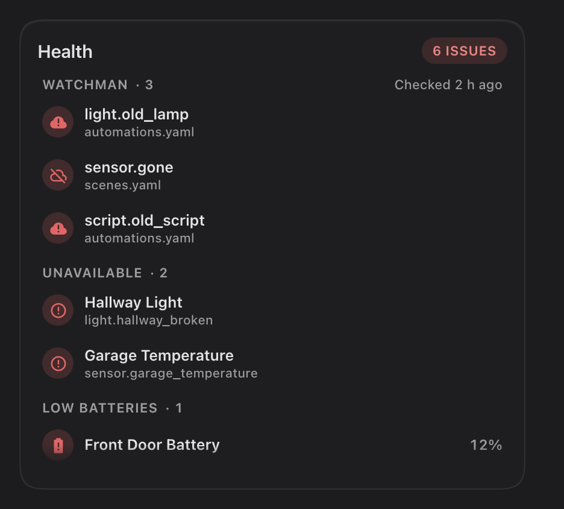

# Savvy Cards

Smart, beautiful cards for Home Assistant. Point a card at a room and it finds what's
there. Every option is in the visual editor, and every card moves and responds the
same way: springs, not transitions; feedback the moment you touch; nothing that jumps.

<p>
  
  
</p>

- [Install](#install)
- [How every Savvy card behaves](#how-every-savvy-card-behaves)
- Cards: [Lights](#lights) · [Climate](#climate) · [Vacuum](#vacuum) · [Health](#health)

> Savvy is growing in waves. Home, room, heading and tile cards come next, then media,
> cameras, the security snapshot, the entity card and graphs.

## Install

**HACS:** HACS → ⋮ → Custom repositories → add this repository as a **Dashboard**, then
install **Savvy Cards**. HACS adds the resource for you.

**Manual:** copy `dist/savvy-cards.js` to `/config/www/`, then add `/local/savvy-cards.js`
as a JavaScript module under Settings → Dashboards → ⋮ → Resources. After an update,
bump a `?v=` number on the resource URL; Home Assistant caches these files hard.

Then edit a dashboard, add a card, and search for **Savvy**.

## How every Savvy card behaves

- **Area first.** Give a card an `area` and it finds what's there through Home
  Assistant's area, device and entity registries: no entity-id naming conventions
  needed. Any part can be pointed at a specific entity instead.
- **Every option is in the editor.** YAML works too; the editor leaves options at their
  defaults out of it.
- **`false` turns any automatic part off.**
- **Tap** does the obvious thing, **hold** opens more-info (or the list of what a group
  chip stands for), and **double tap** is only there where it's configured, so single
  taps never wait for it.
- **Chips** use one spec everywhere: `entity`, `name`, `icon`, `color` (an HA colour name
  like `blue` or a hex), `show_state`, and `tap_action` / `hold_action` /
  `double_tap_action` in Home Assistant's standard action format.
- **Sliders only move when you drag sideways.** A tap, or a finger on its way to
  scrolling the page, never changes a value.
- **`layout: compact`** gives the smaller version of a card.
- **Keyboard:** everything is reachable with Tab and the arrow keys; focus rings only
  appear when you use the keyboard.

---

## Lights

<picture>
  <source media="(prefers-color-scheme: light)" srcset="docs/images/lights-light.png">
  
</picture>

Every light in a room, each with only the controls it supports: a toggle; a brightness
bar; a swatch that opens warmth, colour and saturation. The pill turns the room's lights
on and off, or holds an entity of your own. Hold the pill for a live list of the card's
lights.

```yaml
type: custom:savvy-lights-card
area: living_room
```

| Option | Default | What it does |
|---|---|---|
| `area` | **required** (or `lights`) | The area, or a list of areas for one card across rooms. |
| `lights` | discovered | Only these lights, in this order. An item can be `{entity, power}`, where `power` is a smart plug the light sits behind. |
| `title` | the area's name | Card title. |
| `order` | by name | Lights listed here come first, in this order. The editor starts it as the discovered order: reorder with the arrows. |
| `featured` | none | Lights that get a wide tile. |
| `exclude` | none | Lights to leave out. |
| `show_header` | `true` | The title row. |
| `show_toggle` | `true` | The on/off pill. |
| `toggle` | built in | Put an entity in the pill: `{entity, name, icon, tap_action, double_tap_action, hold_action}`. With an entity, a tap toggles it and a double tap turns every light off. |
| `columns` | automatic | Force a column count. |
| `power_button` | `false` | A power button on every tile. |
| `state_detail` | `true` | Brightness under the name; `false` shows plain On/Off. |
| `color_background` | `false` | Tint lit tiles with their bulb's colour. |
| `chips` | none | Extra chips under the lights. |
| `layout` | `full` | `compact`: toggles only, no sliders or swatches. |

<picture>
  <source media="(prefers-color-scheme: light)" srcset="docs/images/lights-compact-light.png">
  
</picture>

---

## Climate

<picture>
  <source media="(prefers-color-scheme: light)" srcset="docs/images/climate-light.png">
  
</picture>

An A/C or thermostat. Drag the bar sideways for the target (or use − and +), tap a mode,
cycle the fan. Swipe left for its history, with the unit's on/off band under the chart.

```yaml
type: custom:savvy-climate-card
area: living_room
```

| Option | Default | What it does |
|---|---|---|
| `area` | **required** (or `entity`) | Finds the area's climate entity. With several, the editor lets you choose. |
| `entity` | from `area` | A specific climate entity. |
| `name` | the entity's name | Card title. |
| `hvac_modes` | the unit's modes | Which modes to show, in order. Quote `"off"` in YAML. |
| `default_hvac_mode` | the last used | What the power button turns on. |
| `fan_control` | `true` | The fan button (tap cycles the speed). |
| `temperature` / `humidity` | the unit's own reading | Sensors to read (and chart) instead. |
| `weather` | none | An outdoor weather readout. |
| `temperature_name` / `humidity_name` / `state_name` | Temperature / Humidity / A/C | Labels. |
| `timer` | none | `{entity, select}`: a timer, and an `input_select` of durations a tap steps through. |
| `history` | `{hours: 24, show_state: true}` | The history page: the range it opens on, and the on/off band. |
| `temperature_scale` | blue to red | Colour stops for temperatures: `[{value, color}]`. |
| `humidity_color` | teal | Humidity colour. |
| `chips` | none | Extra chips (a button presses, a switch toggles). |
| `layout` | `full` | `compact`: the target and modes in two rows. |

<picture>
  <source media="(prefers-color-scheme: light)" srcset="docs/images/climate-compact-light.png">
  
</picture>

---

## Vacuum

<picture>
  <source media="(prefers-color-scheme: light)" srcset="docs/images/vacuum-light.png">
  
</picture>

Any robot vacuum, deepest for Roborock. Everything is found from the vacuum's device:
the live job, map, rooms (cleaned in the order you tap them), your app routines, modes,
dock and consumables. Rooms, modes, dock and care open as popups. Hold Stop to stop, and
hold "Clean N rooms" to start, so neither happens by accident.

```yaml
type: custom:savvy-vacuum-card
entity: vacuum.robot
```

| Option | Default | What it does |
|---|---|---|
| `entity` | **required** | The vacuum. |
| `name` | the entity's name | Title. |
| `start` | the vacuum's own start | What Start runs: a button, script or scene (an app routine, say). Resume after a pause is always a real resume. |
| `start_name` | `Start` | Start's label. |
| `navigation_path` | none | Tapping the name opens this page. |
| `map` | `popup` | `popup` (a Map button), `inline`, `off`, or an image/camera entity. |
| `map_max_height` | none | Cap the map's height (px). |
| `rooms` | `auto` | Your areas when mapped, else the robot's own rooms. `off`, or a list to limit, order or rename. |
| `routines` | `auto` | Your app routines. `off`, or `[{entity, name, icon}]`. |
| `modes` / `dock` / `maintenance` / `stats` | `auto` | `off` hides a part. |
| `hide_modes` | none | Mode selects to leave out. |
| `exclude` | none | Discovered entities to leave out. |
| `battery_warn` / `battery_critical` | `20` / `10` | The battery ring turns amber / red below these. |
| `layout` | `full` | `compact`: one row with a start / pause button; hold it to send the vacuum home. |

<picture>
  <source media="(prefers-color-scheme: light)" srcset="docs/images/vacuum-compact-light.png">
  
</picture>

---

## Health

<picture>
  <source media="(prefers-color-scheme: light)" srcset="docs/images/health-light.png">
  
</picture>

What in the house needs attention: unavailable entities, low batteries, and (if you use
[Watchman](https://github.com/dummylabs/thewatchman)) its missing entities and actions,
with when Watchman last checked. One count; every category always shows, with its count
or "All good"; tap a row for more-info.

```yaml
type: custom:savvy-health-card
```

| Option | Default | What it does |
|---|---|---|
| `source` | `all` | `all`, or one list: `battery`, `unavailable`, `watchman`. |
| `title` | per source | Title. |
| `battery_threshold` | `20` | A battery below this % is low. |
| `exclude_platforms` | `[mobile_app]` | Integrations to ignore (phones, by default). |
| `watchman` | none | Watchman's summary sensors. |
| `watchman_last_run` | found | Watchman's "last parse" timestamp, shown as "Checked 2 h ago". Found from the Watchman integration; name another sensor, or `false` to hide it. |
| `warn_above` | `6` | The count turns red at this many. |
| `max_rows` | `7` | Rows before the list scrolls. |
| `show_all_batteries` | `true` | With `source: battery`: every battery, low ones first. |
| `action` | none | A footer button: `{label, tap_action}`. |

<picture>
  <source media="(prefers-color-scheme: light)" srcset="docs/images/health-batteries-light.png">
  
</picture>
