# Savvy Cards

A collection of Home Assistant dashboard cards that find their own entities. Point a card at a
room and it shows the lights, climate, media, locks and sensors in that room. Every option is in
the visual editor. The media card is the one to look at first if you have several TVs, consoles or
streamers: it has a source picker and a sound output for each.

The cards share one look and one feel: tactile animations, light and dark themes, and a
reduced-motion mode that turns the animation off.

<p>
  
  
</p>

It is a lot of cards, so here is the short version: **headers** for the top of a page, **room cards**
that follow an area, **device cards** (lights, climate, media and so on), and one optional **settings
card** that holds your page addresses and helpers so you don't repeat them on every card. Use one card
or all of them.

- [Install](#install) · [Quick start](#quick-start) · [How the cards find things](#how-the-cards-find-things)
- [What the cards expect from your dashboard](#what-the-cards-expect-from-your-dashboard)
- [Design](#design) · [Cards](#cards) · [Shared options](#shared-options) · [Troubleshooting](#troubleshooting) · [Development](#development)

## Install

**With HACS.** Open HACS, use the three-dot menu, choose *Custom repositories*, paste
`https://github.com/gabrielmazor/lovelace-savvy-cards` and pick the type **Dashboard**. Then install
**Savvy Cards**. HACS adds the resource for you. Reload the browser once.

**By hand.** Copy `dist/savvy-cards.js` to `/config/www/`, then add `/local/savvy-cards.js` as a
JavaScript module under Settings, Dashboards, three-dot menu, Resources. After an update, change the
`?v=` number on the URL, because Home Assistant caches these files hard.

Needs Home Assistant 2024.8 or newer.

## Quick start

Edit a dashboard, add a card and search for **Savvy**. Or paste this:

```yaml
type: custom:savvy-lights-card
area: living_room
```

That is the whole card: every light in the living room, each with the controls it supports. Most cards
work this way. Give them an `area` (or an `entity`) and leave the rest at its defaults.

## How the cards find things

- **Area first.** A card with an `area` asks Home Assistant's area, device and entity registries what
  is in that room. It never guesses from entity names, so call your entities anything you like. If
  something has no area (a lock is a common one), name it on the card.
- **Your config wins.** Anything you set on a card beats what the card would find.
- **`false` turns a part off.** `camera: false` on a lock card, `weather: false` on a header.
- **Pinned, then discovered.** Where a card shows a row of things, `entities:` lists the ones you want
  first, always shown. Then, unless `auto_discover: false`, the card adds what the area has.
- **Order of authority**, when the same option is set in several places: the card, then the room's
  entry in the settings card, then the settings card's global value, then what the cards find on
  their own (auto-discovery, and the dashboard's own pages).
- **Counting needs no helpers.** Lights on, players playing, average temperature and open doors all come
  straight from your states.

## What the cards expect from your dashboard

Savvy never creates pages. It links to pages you already have, so a few cards need to know where those
are. Most of them are found by name, so there is usually nothing to write down. Without an address a card
still works; it just has nothing to link to.

**Found by name.** The cards read your dashboard's views. A view whose path (or, failing that, title) is
`lights`, `climate`, `media` or `security` becomes that chip's page, and a view named after a room
(`living-room`, or the room's own name) is that room's page. If two different views claim the same name,
nothing is guessed. The health page is never guessed: set it yourself. What you write always wins, and
`false` (in the settings card's `pages`) switches a page off.

| What | Used by | Example |
|---|---|---|
| A home page | the home button on the headers | `/lovelace/home` (set it) |
| One page per room | room tiles, the row of rooms on the room header, the section title | `/lovelace/{slug}` (found by the room's name) |
| A page per domain: lights, climate, media, security | the four chips on the home header (an "open page" button in each popup) | `/lovelace/lights` (found by name) |
| A health page | the health cog on the home header | `/lovelace/admin` (set it) |

For the room pattern, `{slug}` is the area id with dashes (`living_room` becomes `living-room`) and
`{area}` is the id as it is. If your rooms live at `/lovelace/living-room`, use `/lovelace/{slug}`.

Three cards mark where you are:

- **Home header** at the top of any page that is not a room: home page, lights page, admin page.
- **Room header** at the top of a room's page.
- **Section title** over a section. With an `area` it is a small room header; without one it is a plain title.

### Set them once with the settings card

Put one [Savvy settings](#savvy-settings) card on any page. Every Savvy card on that dashboard reads it.
You only need the pages that cannot be found by name: the example below writes them all out.

```yaml
type: custom:savvy-settings-card
pages:
  home: /lovelace/home
  lights: /lovelace/lights
  climate: /lovelace/climate
  media: /lovelace/media
  security: /lovelace/security
  health: /lovelace/admin
  room: /lovelace/{slug}
house:
  control: input_select.house_mode      # the header's mode chip, if you have one
  weather: weather.home
  tap: navigate                         # a chip tap goes to its page; hold opens the list
health:
  watchman: [sensor.watchman_missing_entities]
  battery_threshold: 20
room_order: [living_room, kitchen, bedroom]
rooms:
  kitchen:
    control: input_select.kitchen_scene
    light_state: switch.kitchen_lights
    temperature: sensor.kitchen_temperature
```

With that in place a bare `type: custom:savvy-home-header-card` already has its pages, mode chip and
weather, and a section title for `area: kitchen` has the kitchen's mode and temperature. Each card's
editor lists what it is taking from the settings under **From Savvy settings**.

## Design

Every card follows the same few rules, so a dashboard of them reads as one thing. One surface per card, with rows
inside it rather than boxes inside boxes; type and space make the hierarchy, and colour appears only on what is on,
running or wrong. The icon of a thing (a room, a light, a lock, a player) stands bare, grey when idle and in its colour
when on; only an alert keeps a tinted disc. Where a row can be the control it is: a light's row switches it with a
tap, dims it with a sideways drag and opens its details with a hold. Anything else you press (power, a colour swatch,
a step, a button in a popup) is a rounded square. A card with a state, such as a lit
light, a locked door, music playing or something broken, glows softly in one corner in the colour of its icon (the lights card takes the colour of the
lit colour light, like the room tile), and shows nothing when it is idle. Turn the glow off with `state_glow: false` on a card, or for all of
them with `design: { state_glow: false }` in the settings card. The cards also have smooth, tactile
animations, light and dark themes, and honour reduced motion.

### Glass

<picture><source media="(prefers-color-scheme: light)" srcset="docs/images/glass-light.png">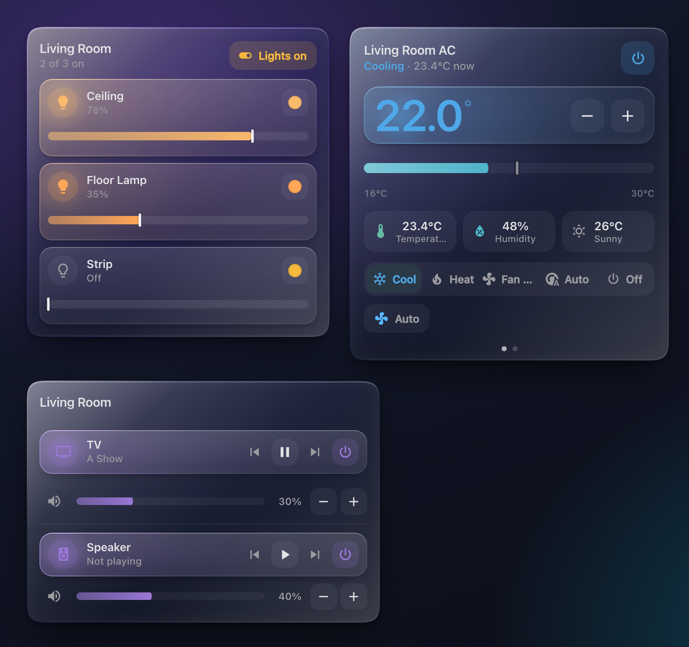</picture>

An optional second design, after Apple's liquid glass: a tinted, saturated pane with a bright specular rim and sheen, a highlight that follows the pointer, and everything that is on is a light source: the
icon of a lit light, a person at home, a playing speaker, a cooling thermostat throws its colour into its
own tile, brightest at the icon and fading with distance, with a thin rim light on the tile's nearest edge.
The light is the tile's own layer, so it shows on a plain black dashboard too; the frosted blur needs a
background behind the cards (a wallpaper or a soft gradient) to show. A lamp throws more light the
brighter it is.

Turn it on for every card with `design: { style: glass }` in the [settings card](#savvy-settings), or for
one card with `design: glass` (`design: plain` on a card keeps it plain when the dashboard is glass). It
switches itself off for people who ask their device for reduced transparency. Without it, nothing changes:
`plain` is the default.

### Matte

<picture><source media="(prefers-color-scheme: light)" srcset="docs/images/matte-light.png">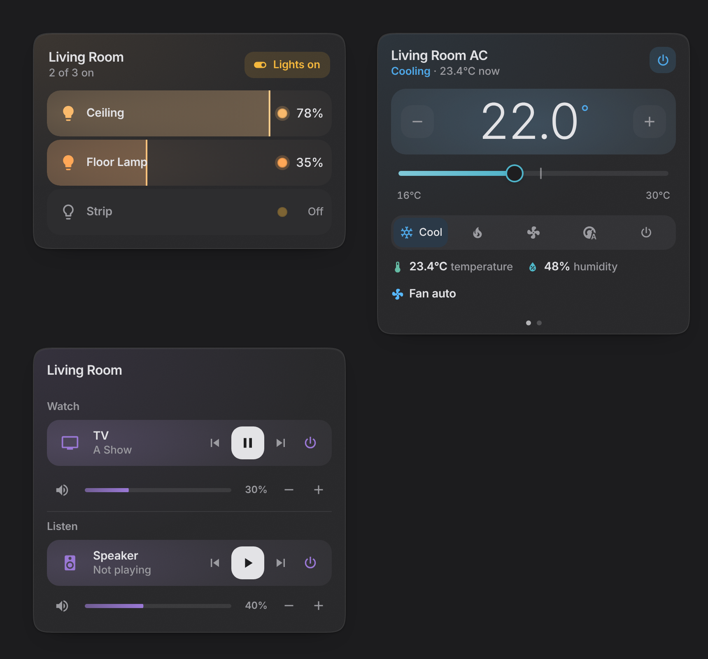</picture>

The same layout again, in a flat, solid material, the opposite of glass: opaque surfaces built from your
theme's own card colour, tiles told apart by tone and a hairline edge instead of bevels and shadows, and a quiet
lift only under cards and popups. A lit tile is painted, not lit: its
state colour (desaturated a little, so amber, green and blue sit in one family) washes the tile from the icon
outwards, with a thin coloured edge on the icon's side, stronger the brighter the lamp. No blur and no
transparency, so it works on any background and is the lightest style on a tablet.

Turn it on with `design: { style: matte }` in the [settings card](#savvy-settings), or on one card with
`design: matte` (`design: plain` keeps a card plain).

## Cards

| Card | What it shows | Type |
|---|---|---|
| [Home header](#home-header) | Mode, weather, health cog and four counting chips | `custom:savvy-home-header-card` |
| [Room header](#room-header) | A room's mode, temperature, badges and a row to other rooms | `custom:savvy-room-header-card` |
| [Section title](#section-title) | A title, or a room's name with its badges | `custom:savvy-section-title-card` |
| [Room tile](#room-tile) | A room at a glance, with its lights | `custom:savvy-room-tile` |
| [Room activity](#room-activity) | Presence, doors, locks and readings with "since when" | `custom:savvy-room-activity-card` |
| [Lights](#lights) | Every light of a room: toggle, brightness, colour | `custom:savvy-lights-card` |
| [Climate](#climate) | An A/C or thermostat, with history | `custom:savvy-climate-card` |
| [Media](#media) | Sources, speakers, volume, presets | `custom:savvy-media-card` |
| [Camera](#camera) | Live cameras, Frigate events and recordings | `custom:savvy-camera-card` |
| [Lock](#lock) | A door lock with door, battery, alarm and camera | `custom:savvy-lock-card` |
| [Vacuum](#vacuum) | A robot vacuum: rooms, map, dock | `custom:savvy-vacuum-card` |
| [Scenes](#scenes) | Every scene of a room as a tile | `custom:savvy-scene-card` |
| [Last check](#last-check) | What would be left on when you leave or go to bed, and one slide to turn it off | `custom:savvy-last-check-card` |
| [Home story](#home-story) | What happened at home, in plain sentences | `custom:savvy-story-card` |
| [Covers](#covers) | Blinds, shutters, curtains, garage and gate of a room | `custom:savvy-cover-card` |
| [People](#people) | Who is home, where the others are, battery and time to get home | `custom:savvy-people-card` |
| [Fans](#fans) | Fans, air purifiers and humidifiers of a room | `custom:savvy-fan-card` |
| [Energy](#energy) | What the house used and cost, against the period before, with live power | `custom:savvy-energy-card` |
| [System health](#system-health) | Offline devices, low batteries, Watchman | `custom:savvy-system-health-card` |
| [Entity](#entity) | One entity and the ones that go with it | `custom:savvy-entity-card` |
| [Graph](#graph) | Number and state tiles with history | `custom:savvy-graph-card` |
| [Savvy settings](#savvy-settings) | The defaults every card shares | `custom:savvy-settings-card` |

Each card below follows the same layout: what it is, a picture, every option in a table, the smallest
config that works, and a full example. Types in the tables: *entity* is an entity id, *action* is a
Home Assistant action (`tap_action: { action: navigate, navigation_path: /lovelace/x }`), *chips* is the
[chip format](#chips). Options shared by several cards are described once in [Shared options](#shared-options).

---

### Home header

<picture><source media="(prefers-color-scheme: light)" srcset="docs/images/home-header-light.png"></picture>

The top of any page that is not a room: a mode chip, the weather, a health cog with a count, and four
chips that count by themselves (lights on, average indoor temperature, what is playing, security). Hold a
chip for the entities behind it. Without a mode chip the header is a single row that slides sideways when
it is too wide.

<picture><source media="(prefers-color-scheme: light)" srcset="docs/images/home-header-row-light.png">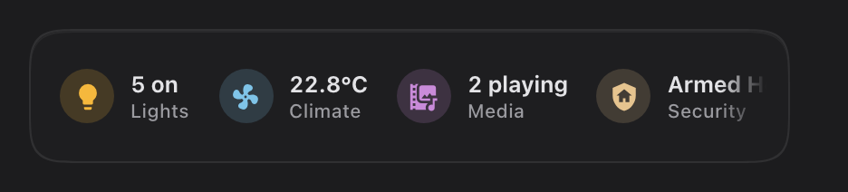</picture>

| Option | Type | Default | What it does |
|---|---|---|---|
| `control` | entity | none | One entity as a chip. A select opens a picker, a button, script or scene runs, a switch toggles, anything else opens more-info. Never guessed. |
| `show_control` | boolean | `true` | `false` hides the control even when the settings card supplies one. |
| `mode_label` | string | `Home mode` | Caption under a select's value. |
| `mode_icons`, `mode_colors` | object | built-in dictionary | Icon or colour per option of the select: `Movie Night: mdi:popcorn`. |
| `control_tap_action`, `control_hold_action`, `control_double_tap_action` | action | by domain | What the control does. |
| `home_path` | string | none | Page the home button opens. |
| `show_home` | boolean | `true` | `false` hides the home button even when the settings card supplies a page. The button is also hidden on the home page itself. |
| `weather` | entity or `false` | first weather entity | The weather shown. |
| `health` | object or `false` | on | The health cog, see below. |
| `admin_only` | list or boolean | from the settings | Kept from people who are not administrators: `health_cog` (the cog, its count and its popup) and `health_badges` (the count on the cog; the cog stays). `true` is both, `false` hides nothing even when the settings list something. Nothing is hidden unless it is listed here or in the settings. |
| `lights`, `climate`, `media`, `security` | object or `false` | on | The four counting chips, see below. |
| `room_order` | list of areas | by name | Order of rooms in the popups. A chip's own `room_order` wins. |
| `design` | object | none | `style: glass` or `style: matte` turns on the [glass](#glass) or [matte](#matte) design for every card (a card's own `design` wins); `state_glow: false` turns the corner glow off on every card; a card's own `state_glow` still wins. `animations: false` keeps every room tile still; a tile's own `animations` wins. |
| `aggregate` | `true` or list of kinds | off | Show each room's presence sensors once. See [Aggregate sensors](#aggregate-sensors). |
| `chips` | chips | none | Your own chips after the four. |
| `title` | string | none | A line at the top of the card. |
| `title_path` | string | none | Title link: tapping the title opens this page. Only the words are the link. |

**`health` options.** `navigation_path` (string, none) where the popup's page button leads; `popup_button`
(boolean, `true`) that button, shown whenever there is a target page (the popup's title leads there too, button or not); `popup_label` (string, "Open system
health"); `tap_action`, `hold_action` (action, open the list); `dismiss` (boolean, `true`) the dismiss
buttons in the popup; and the [System health](#system-health) options `watchman`, `watchman_button`,
`watchman_report`, `battery_threshold`, `warn_above`, `exclude_platforms`, `group_by`, `group_min`, `startup_wait`, `ignore`.

**Chip options** for `lights`, `climate`, `media`, `security`:

| Option | Type | Default | What it does |
|---|---|---|---|
| `entity` | entity | none | Show this entity's state instead of the count. |
| `name`, `icon`, `color` | string | per chip | Look. |
| `navigation_path` | string | none | Target of the popup's page button. It does not change what a tap does. |
| `popup_button` | boolean | `true` | The page button at the bottom of the popup. The popup's title also leads to the target page, with or without the button. |
| `popup_label` | string | "Open lights" etc. | Its text. |
| `exclude` | list of entities | none | Left out of the count and the popup. |
| `exclude_areas` | list of areas | none | Everything in these rooms is left out. |
| `sort` | `room` or `recent` | `room` | How the popup lists. |
| `sort_toggle` | boolean | `true` | The Room / Recent switch at the top of the popup. |
| `room_order` | list of areas | card's, then settings' | Room order for this chip. |
| `bulk_action` | boolean | `true` | The All off / Pause all / Lock all button. |
| `tap_action`, `hold_action` | action | open the list | Replace the gesture. To make a tap go to a page, use `action: navigate`. |

Minimum:

```yaml
type: custom:savvy-home-header-card
```

Full:

```yaml
type: custom:savvy-home-header-card
control: input_select.house_mode
mode_label: House mode
mode_icons: { Movie Night: mdi:popcorn }
home_path: /lovelace/home
weather: weather.home
room_order: [living_room, kitchen]
aggregate: true
admin_only: [health_cog]         # a non-admin does not see the cog at all
health:
  navigation_path: /lovelace/admin
  watchman: [sensor.watchman_missing_entities]
  battery_threshold: 20
lights:
  navigation_path: /lovelace/lights
  exclude_areas: [garden]        # not counted, not listed
  sort: recent
climate: { navigation_path: /lovelace/climate }
media: { navigation_path: /lovelace/media }
security: { navigation_path: /lovelace/security }
chips:
  - entity: switch.coffee_machine
    name: Coffee
```

---

### Room header

<picture><source media="(prefers-color-scheme: light)" srcset="docs/images/room-header-light.png"></picture>

The top of a room's page: its mode, its temperature, a row of everything the room has (idle things
dimmed), your own chips, and a row to jump to the other rooms.

| Option | Type | Default | What it does |
|---|---|---|---|
| `area` | area | **required** | The room. |
| `control`, `mode_label`, `mode_icons`, `mode_colors`, `control_tap_action`, `control_hold_action`, `control_double_tap_action` | | none, `Room mode` | The room's mode or scenes, or any entity. Same as on the [home header](#home-header). |
| `temperature` | entity or `false` | found | The area's temperature sensor, else its climate unit's reading. |
| `home_path` | string | from settings | Home button page. Empty hides it. |
| `lights` | boolean | `true` | How many of the room's lights are on, first in the row; a tap lists them. With `auto_discover: false` it shows only when set to `true`. |
| `entities`, `auto_discover`, `exclude_kinds`, `include`, `exclude` | | discovered | The badge row, see [Badges](#badges). Here every kind the room has shows, active or not; idle ones dimmed. |
| `aggregate` | `true` or list | off | See [Aggregate sensors](#aggregate-sensors). |
| `icons_only` | boolean | `false` | Just the coloured icons. |
| `chips` | chips | none | Your own chips, in a row of their own. |
| `room_path` | string | from settings | Turns on the row of rooms; where each one goes (`/lovelace/{slug}`). |
| `room_order` | list of areas | by name | Rooms listed first, in this order. |
| `exclude_rooms` | list of areas | none | Rooms left out of the row. |
| `rooms` | list | none | Per room: `{ area, name, icon, navigation_path }`. |
| `title` | string | none | A line at the top of the card. |
| `title_path` | string | none | Title link: tapping the title opens this page. Only the words are the link. |

Minimum:

```yaml
type: custom:savvy-room-header-card
area: living_room
```

Full:

```yaml
type: custom:savvy-room-header-card
area: living_room
control: input_select.living_room_scene
mode_label: Scene
home_path: /lovelace/home
temperature: sensor.living_room_temperature
entities: [switch.living_room_lights]   # pinned first
auto_discover: true
exclude_kinds: [fan]
include: [lock.front_door]                    # a lock that has no area
exclude: [binary_sensor.hallway_motion]
aggregate: true
icons_only: false
chips:
  - entity: script.movie_night
    name: Movie
room_path: /lovelace/{slug}
room_order: [living_room, kitchen]
exclude_rooms: [garage]
```

---

### Section title

<picture><source media="(prefers-color-scheme: light)" srcset="docs/images/section-title-light.png"></picture>

A title for a section. With a `name` it is plain text. With an `area` it shows the room's name and icon,
its mode, temperature and badges. No background unless `background: true`.

| Option | Type | Default | What it does |
|---|---|---|---|
| `area` | area | none | Makes it a room title. Without `area` it is a plain title and needs `name`. |
| `name`, `icon` | string | the area's | Title and icon. |
| `navigation_path` | string | none | Where tapping the name goes. |
| `tap_action`, `hold_action` | action | none | Replace the gesture on the name. |
| `control`, `mode_label`, `mode_icons`, `mode_colors`, `control_*_action` | | none | The room's mode, as on the [room header](#room-header). |
| `temperature` | entity or `false` | found | Room temperature. |
| `entities`, `auto_discover`, `exclude_kinds`, `include`, `exclude` | | discovered | The badges, see [Badges](#badges). |
| `aggregate` | `true` or list | off | See [Aggregate sensors](#aggregate-sensors). |
| `heading_style` | `title` or `subtitle` | `title` | `subtitle` for a smaller heading. |
| `background` | boolean | `false` | Sit on a card background. (`filled`, the old name, still works.) |
| `title_path` | string | none | The same as `navigation_path`, written like the other cards. `title` is the same as `name`. |

Minimum:

```yaml
type: custom:savvy-section-title-card
name: Appliances
```

Full:

```yaml
type: custom:savvy-section-title-card
area: living_room
name: Lounge
icon: mdi:sofa
navigation_path: /lovelace/living-room
control: input_select.living_room_scene
temperature: sensor.living_room_temperature
entities: [switch.living_room_lights]
auto_discover: true
exclude_kinds: [window]
include: [lock.front_door]
exclude: [binary_sensor.hallway_motion]
aggregate: [presence, door]
heading_style: title
background: false
```

---

### Room tile

<picture><source media="(prefers-color-scheme: light)" srcset="docs/images/tiles-light.png"></picture>

A room at a glance. Its icon sits in a small drop that fills with the room's light. Tap goes to the room
(or lists its lights), double tap switches the lights, hold lists them.

| Option | Type | Default | What it does |
|---|---|---|---|
| `area` | area | **required** | The room. |
| `name`, `icon` | string | the area's | Title and icon. |
| `navigation_path` | string | from settings | Where a tap goes. Without it a tap lists the room's lights. |
| `control`, `mode_icons`, `mode_colors` | | none | Shown under the name, read only: a select's option or any entity's state. |
| `temperature` | entity or `false` | found | Room temperature. |
| `toggle` | entity | the lights | An entity (a helper your automations use) that the double tap switches instead. |
| `lights` | list of lights | the area's | Only these lights make up the drop. |
| `count` | entity | counted | A sensor with the number of lights on. |
| `color_lights` | list of lights | `lights` | Lights whose colour tints the drop. |
| `tint` | colour | `#F5B83D` | The drop's colour for white light. |
| `entities`, `auto_discover`, `exclude_kinds`, `include`, `exclude` | | discovered | The badges, see [Badges](#badges). |
| `aggregate` | `true` or list | off | See [Aggregate sensors](#aggregate-sensors). |
| `tap_action`, `double_tap_action`, `hold_action` | action | as above | Replace any gesture. |
| `animations` | boolean | `true` | The drop's movement and glow, badges popping in, text rolling. `false` keeps the tile still. In the settings card, `design: { animations: false }` does it for every room tile; a tile's own setting wins. |
| `state_glow` | boolean | `true` | A soft glow in the card's corner in what it is doing (a lit light, a locked door, music playing). `false` keeps the card plain. |

Minimum:

```yaml
type: custom:savvy-room-tile
area: kitchen
```

Full:

```yaml
type: custom:savvy-room-tile
area: kitchen
name: Kitchen
icon: mdi:silverware-fork-knife
navigation_path: /lovelace/kitchen
control: input_select.kitchen_scene
temperature: sensor.kitchen_temperature
toggle: switch.kitchen_lights
lights: [light.kitchen_ceiling, light.kitchen_counter]
count: sensor.kitchen_lights_count
color_lights: [light.kitchen_counter]
tint: "#F5B83D"
entities: [binary_sensor.kitchen_presence]
auto_discover: true
exclude_kinds: [window]
aggregate: true
```

---

### Room activity

<picture><source media="(prefers-color-scheme: light)" srcset="docs/images/room-activity-light.png"></picture>

What is happening in a room and when it last changed: presence ("for 12 min"), doors, windows, locks,
readings, and smoke, gas and leak sensors that stay quiet until one trips. A state that is on shows its own
colour: presence in the accent, an open door, window or unlocked lock in amber, an alert in red; idle stays
grey. Name an alarm and an open door while it is armed turns red. Swipe left for the room's history.

<picture><source media="(prefers-color-scheme: light)" srcset="docs/images/room-activity-compact-light.png"></picture>

| Option | Type | Default | What it does |
|---|---|---|---|
| `area` | area | **required** (or `chips`) | The room. |
| `name`, `icon` | string | the area's | Title and icon. |
| `layout` | `full` or `compact` | `full` | `compact`: one row of icons and the temperature. |
| `navigation_path` | string | none | Where tapping the name goes. |
| `presence`, `door`, `window`, `lock`, `temperature`, `humidity`, `illuminance`, `smoke`, `gas`, `co`, `leak` | entity, list, or `false` | found | Name the sensor(s) of a kind yourself, or `false` for none. |
| `include` | list of entities | none | Entities with no area, shown with this room (a lock, a door contact). |
| `exclude_kinds` | list of kinds | none | Kinds to hide (any of the keys above). |
| `exclude` | list of entities | none | Entities never shown. |
| `alarm` | entity or `auto` | none | The alarm panel. Adds the armed pill, and an open door or window while armed (presence while armed away) turns red. `auto` uses the house's first panel. |
| `colored_states` | boolean | `true` | Presence in the accent, open doors, windows and unlocked locks amber, alerts red. `false` keeps everything grey. |
| `aggregate` | `true` or list | off | See [Aggregate sensors](#aggregate-sensors). |
| `history` | object or `false` | `{ hours: 24, ranges: [6, 24, 72], show_state: true }` | The history page. |
| `lux_labels` | object or `false` | `{ dark: 10, dim: 150 }` | Light reads as Dark, Dim or Bright; `false` shows the number. |
| `chips` | chips | none | Your own. With no `area`, a hand-picked overview. |
| `state_glow` | boolean | `true` | A soft glow in the card's corner in what it is doing (a lit light, a locked door, music playing). `false` keeps the card plain. |
| `title_path` | string | none | Title link: tapping the name opens this page. Only the words are the link, so it replaces the whole name block as a tap target. `title` writes the name, like `name`. |

Minimum:

```yaml
type: custom:savvy-room-activity-card
area: living_room
```

Full:

```yaml
type: custom:savvy-room-activity-card
area: living_room
name: Living room
icon: mdi:sofa
layout: full
navigation_path: /lovelace/living-room
temperature: sensor.living_room_temperature
door: binary_sensor.patio_door
include: [lock.front_door]                 # a lock with no area
exclude_kinds: [humidity]
exclude: [binary_sensor.hallway_motion]
alarm: alarm_control_panel.home            # or auto; leave out for none
colored_states: true
aggregate: true
history: { hours: 24, ranges: [6, 24, 72] }
lux_labels: { dark: 10, dim: 150 }
chips:
  - entity: switch.fan
```

---

### Lights

<picture><source media="(prefers-color-scheme: light)" srcset="docs/images/lights-light.png"></picture>

Every light in a room, each with only the controls it supports: a toggle, a brightness bar, and a swatch
for warmth and colour. The pill at the top switches the room, or an entity of your own. Hold it for a live list.

<picture><source media="(prefers-color-scheme: light)" srcset="docs/images/lights-compact-light.png"></picture>

| Option | Type | Default | What it does |
|---|---|---|---|
| `area` | area or list | **required** (or `lights`) | The room, or several for one card across rooms. |
| `lights` | list | discovered | Only these lights, in this order. An item is an entity id or `{ entity, power }`, where `power` is a smart plug the light sits behind. |
| `title` | string | the area's name | Card title. |
| `order` | list of lights | by name | Listed lights come first, in this order. With none, the card takes the `order` of the first lights card for the same room that has one, wherever it is on the dashboard (the editor says which, with an **Unlink** button). |
| `sync_order` | boolean | `true` | `false`: never take another card's order. |
| `featured` | list of lights | none | Lights that get a wide tile. |
| `include` | list of lights | none | Lights to show besides the area's, such as one an integration files as a setting or diagnostic entity, which discovery skips. |
| `exclude` | list of lights | none | Lights left out. |
| `show_header` | boolean | `true` | The title row. |
| `show_toggle` | boolean | `true` | The on/off pill. |
| `toggle` | entity or object | built in | An entity for the pill: `{ entity, name, icon, tap_action, double_tap_action, hold_action }`. With an entity a tap toggles it and a double tap turns every light off. |
| `columns` | number 1-6 | automatic | Force a column count. |
| `power_button` | boolean | `false` | A power button on every tile. |
| `state_detail` | boolean | `true` | Brightness under the name; `false` shows On/Off. |
| `color_background` | boolean | `false` | Tint lit tiles with their bulb's colour. |
| `chips` | chips | none | Extra chips under the lights. |
| `layout` | `full` or `compact` | `full` | `compact`: toggles only, no sliders or swatches. |
| `state_glow` | boolean | `true` | A soft glow in the card's corner in what it is doing (a lit light, a locked door, music playing). `false` keeps the card plain. |
| `title_path` | string | none | Title link: tapping the title opens this page. Only the words are the link. |

Minimum:

```yaml
type: custom:savvy-lights-card
area: living_room
```

Full:

```yaml
type: custom:savvy-lights-card
area: [living_room, hallway]
title: Downstairs
layout: full
show_header: true
show_toggle: true
toggle:
  entity: switch.downstairs_lights
  name: All
order: [light.ceiling, light.floor_lamp]
featured: [light.ceiling]
exclude: [light.garden_string]
lights:
  - light.ceiling
  - entity: light.desk_lamp
    power: switch.desk_plug
columns: 3
power_button: false
state_detail: true
color_background: true
chips:
  - entity: scene.movie
```

---

### Climate

<picture><source media="(prefers-color-scheme: light)" srcset="docs/images/climate-light.png"></picture>

An A/C or thermostat. Drag the bar sideways for the target (or use minus and plus), tap a mode, cycle
the fan. Swipe left for history with the unit's on/off band under the chart.

<picture><source media="(prefers-color-scheme: light)" srcset="docs/images/climate-compact-light.png"></picture>

| Option | Type | Default | What it does |
|---|---|---|---|
| `area` | area | **required** (or `entity`) | Finds the area's climate entity. With several, the editor lets you choose. |
| `entity` | entity | from `area` | A specific climate entity. |
| `name` | string | the entity's | Card title. |
| `layout` | `full` or `compact` | `full` | `compact`: target and modes in two rows. |
| `steppers` | `sides` or `right` | `sides` | Where − and + sit: either side of the number, or together on the right with the number on the left. |
| `hvac_modes` | list | the unit's modes | Which modes show, in order. Quote `"off"` in YAML. |
| `default_hvac_mode` | string | last used | What the power button turns on. |
| `fan_control` | boolean | `true` | The fan button: a tap lists the unit's fan speeds, the current one marked. |
| `temperature`, `humidity` | entity | the unit's reading | Sensors to read (and chart) instead. |
| `weather` | entity | none | An outdoor weather readout. |
| `temperature_name`, `humidity_name`, `state_name` | string | Temperature, Humidity, A/C | Labels. |
| `timer` | object | none | `{ entity, presets }`: a `timer` helper. A tap lists the durations (`presets`, minutes, default `[15, 30, 60, 120]`) and starts the timer with the one you pick; while it runs, a tap offers +15 min, pause and cancel. The helper only counts: an automation on `timer.finished` turns the unit off. |
| `history` | object | `{ hours: 24, show_state: true }` | History range and the on/off band. |
| `temperature_scale` | list | blue to red | Colour stops: `[{ value, color }]`. |
| `humidity_color` | colour | teal | Humidity colour. |
| `chips` | chips | none | Extra chips (a button presses, a switch toggles). |
| `state_glow` | boolean | `true` | A soft glow in the card's corner in what it is doing (a lit light, a locked door, music playing). `false` keeps the card plain. |
| `title_path` | string | none | Title link: tapping the name opens this page. Only the words are the link. `title` writes the name, like `name`. |

Minimum:

```yaml
type: custom:savvy-climate-card
area: living_room
```

Full:

```yaml
type: custom:savvy-climate-card
entity: climate.living_room_ac
name: Living room A/C
layout: full
hvac_modes: [cool, heat, fan_only, "off"]
default_hvac_mode: cool
fan_control: true
temperature: sensor.living_room_temperature
humidity: sensor.living_room_humidity
weather: weather.home
temperature_name: Inside
humidity_name: Humidity
state_name: A/C
timer:
  entity: timer.ac_off
  presets: [15, 30, 60, 120, 180]
history: { hours: 48, show_state: true }
temperature_scale:
  - { value: 16, color: "#4f9de8" }
  - { value: 30, color: "#e8584f" }
humidity_color: teal
chips:
  - entity: button.ac_sleep_mode
    name: Assume on
```

---

### Media

<picture><source media="(prefers-color-scheme: light)" srcset="docs/images/media-sources-light.png">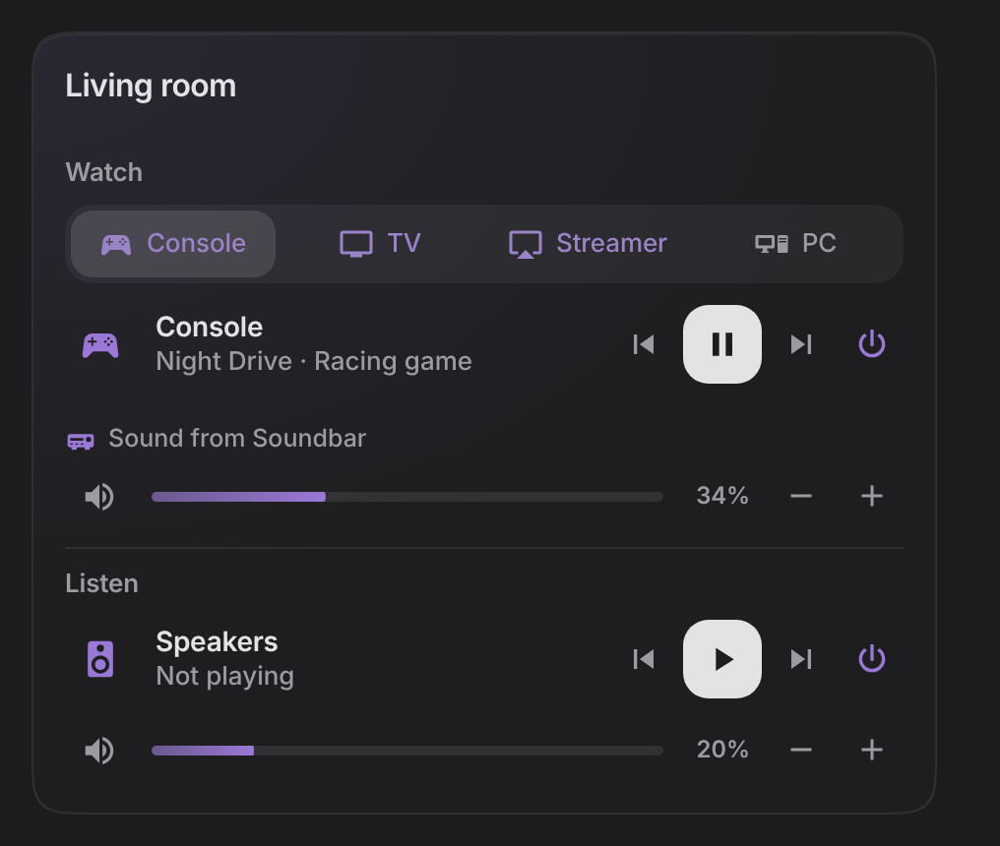</picture>

**One card for everything that plays in a room.** Pick the video source (TV, console, streamer, PC) with
one tap, and the card shows what it is playing and its controls. Each source can send its sound to the
output you choose. The screen (the TV) owns the volume of everything watched on it: an Apple TV or a console
has no bar of its own. When the TV sends its sound to the soundbar you name in `video_output` (eARC), the bar
under the picked source is the soundbar's own, with its real level ("Sound from Soundbar"); when the TV plays
through its own speakers, it is the TV's. A soundbar that is the TV's sound leaves Listen while the TV is on,
so one box never shows two bars; with the TV off it is back in Listen, for music on its own. Nothing is
guessed: without `video_output` the TV plays through itself. Speakers sit under the screen, each with its own
volume, and two or more get a picker. With both kinds on the card, the bands are captioned Watch and Listen.

With inputs, the screen frames them: the TV's name, the input it is on and its power at the top, then the
inputs (the TV itself as "TV apps"), what the picked one is playing, and the screen's sound and its one volume.
`screen_frame: false` keeps the TV as one more input in the picker instead.
Give each input its `input` (`HDMI 2`) and the picker follows the TV, even when you switch with the remote,
and picking an input switches the TV to it.

<picture><source media="(prefers-color-scheme: light)" srcset="docs/images/media-light.png"></picture>

**Switch where the TV's sound goes.** An LG TV (the webOS integration) shows its sound output under it as a
button: tap it for TV speaker, HDMI ARC, Optical, Bluetooth and the rest, the current one marked. On its own
speaker the volume under it is the TV's; on ARC or optical it is the soundbar's. Any other TV whose integration
has a select entity for its sound output works the same with `sound_select`.

With a player that has artwork, the card also shows what is playing, the way a phone would. It also has
presets, text to speech and an alarm clock. Volume moves only on a sideways drag, or with minus and plus.

<picture><source media="(prefers-color-scheme: light)" srcset="docs/images/media-compact-light.png"></picture>

| Option | Type | Default | What it does |
|---|---|---|---|
| `area` | area | **required** (or `video` / `audio`) | Speakers and receivers become outputs; TVs and the rest become sources. |
| `name` | string | the area's | Title. |
| `layout` | `full` or `compact` | `full` | `compact`: one row with what is playing, its transport and the volume. |
| `video` | list | found | The video sources in the picker (TVs, consoles, streamers, PCs): `{ entity, name, icon, power, screen, input, output, volume, artwork, sound_select, sound_outputs }`. `power`: a switch that turns it on. `screen`: the TV it plays on, in a room with two. `input`: the TV's input it is on (`HDMI 2`): the picker follows what is really on screen, and picking it switches the TV. `output`: on a screen, the soundbar it sends its sound to; it wins over `video_output`. `volume`: a helper that holds its real volume. `artwork`: a binary sensor that says its artwork is worth showing. `sound_select`: a select entity that switches where its sound goes (an LG TV needs none, see below). `sound_outputs`: the LG outputs to list, or `false` for none. |
| `audio` | list | found | The speakers, under the sources with their own transport and volume; two or more get a picker. Same item format as `video`. |
| `screen_frame` | boolean | `true` | The screen on its own row above its inputs. `false`: the TV is one more input in the picker. |
| `screen` | entity | the first TV among `video` | The TV the video sources play on. It owns their volume. Every TV is its own screen; any other source plays on this one unless its own `screen` says otherwise (a room with two TVs). |
| `video_output` | entity | none | The soundbar or receiver the main screen sends its sound to (eARC). While it does (an LG says so; another TV while the soundbar is on, and the soundbar is on its TV input), the bar is the soundbar's, and the soundbar leaves Listen. The soundbar playing something of its own (Spotify, Bluetooth) is not the TV's sound: it stays in Listen. A second TV uses only its own `output`. Empty: the TV plays through itself. |
| `output_source` | string | TV, ARC, eARC, HDMI, optical | The soundbar's source while it plays the TV, when it has another name. |
| `presets` | chips | none | Stations and playlists. |
| `tts` | object | none | `{ action, data, placeholder }`: a text box. `$MSG` in `data` is where the text goes. |
| `alarm` | object | none | `{ entity, time, name }`: an alarm clock that rings here. |
| `chips` | chips | none | The room's other controls. |
| `labels` | object or `false` | Watch / Listen | `{ video, audio }`: the captions over each band, shown when the card has both. `false` hides them. |
| `artwork` | boolean | `true` | The artwork stage. |
| `artwork_max_height` | number (px) | none | Cap the artwork's height. |
| `volume_buttons` | boolean | `true` | The minus and plus buttons. |
| `volume_step` | number (%) | `5` | Their step. |
| `state_glow` | boolean | `true` | A soft glow in the card's corner in what it is doing (a lit light, a locked door, music playing). `false` keeps the card plain. |
| `title_path` | string | none | Title link: tapping the name opens this page. Only the words are the link. `title` writes the name, like `name`. |

Minimum:

```yaml
type: custom:savvy-media-card
area: living_room
```

Full:

```yaml
type: custom:savvy-media-card
area: living_room
name: Living room
layout: full
video:
  - entity: media_player.tv
    name: TV
    power: switch.tv_plug
  - entity: media_player.console
    input: HDMI 2                      # the TV's input it is on: the picker follows the TV, and switches it
    artwork: binary_sensor.console_online
  - entity: media_player.pc
    name: PC
    input: HDMI 3
    output: media_player.speakers      # this one plays through the speakers, not the soundbar
audio:
  - entity: media_player.soundbar
  - entity: media_player.speakers
screen: media_player.tv                # the sources play on the TV: it owns their volume
video_output: media_player.soundbar    # the TV sends its sound here (eARC): then the bar is the soundbar's
presets:
  - entity: script.play_radio
    name: Jazz
tts:
  action: tts.speak
  data: { media_player_entity_id: media_player.soundbar, message: $MSG }
  placeholder: Say something
alarm:
  entity: switch.wake_up_alarm
  time: input_datetime.wake_time
  name: Wake up
chips:
  - entity: switch.adaptive_lighting
labels: { video: Watch, audio: Listen }
artwork: true
artwork_max_height: 320
volume_buttons: true
volume_step: 5
```

---

### Camera

<picture><source media="(prefers-color-scheme: light)" srcset="docs/images/camera-light.png"></picture>

Live cameras, side by side when there is room and a swipe apart when there is not. With
[Frigate](https://github.com/blakeblackshear/frigate-hass-integration), which is found by itself: the
day's alerts and detections, a motion timeline, and recordings that play in sync across cameras. Drag up
from the timeline to scrub finer: the same width then covers 6 hours, 1 hour, then 10 minutes, with seconds
on the label. Cameras
are muted; when a stream carries sound a speaker button appears (live and in recordings, and in the
camera popup of the lock card). The sound only exists if your camera sends it.

| Option | Type | Default | What it does |
|---|---|---|---|
| `area` | area or list | **required** (or `cameras`) | The areas whose cameras to show. |
| `cameras` | list | found | Instead of the area's: `{ entity, name, area, frigate_camera }`, in this order. |
| `frigate` | `false` or object | found | `false` turns Frigate off; `{ instance }` names another instance. |
| `recordings` | `popup`, `inline` or `false` | `popup` | Where the timeline and reviews live. |
| `columns` | number or `auto` | by width | Cameras side by side (`1`: one at a time). |
| `days` | number | `7` | Days of recordings offered. |
| `aspect_ratio` | string | `16/9` | The tiles' shape. |
| `audio_button` | boolean | `true` | A speaker button on a camera that has sound. Everything starts muted and one tap turns the sound on. It goes back to muted when the picture restarts, the card leaves the screen, a popup closes or the tab is hidden. `false` removes the button. |
| `title` | string | none | A line at the top of the card. |
| `title_path` | string | none | Title link: tapping the title opens this page. Only the words are the link. |

Minimum:

```yaml
type: custom:savvy-camera-card
area: living_room
```

Full:

```yaml
type: custom:savvy-camera-card
area: [living_room, kitchen]
cameras:
  - entity: camera.porch
    name: Porch
    area: hallway
    frigate_camera: porch_cam
frigate: { instance: frigate }
recordings: inline
columns: 2
days: 14
aspect_ratio: 4/3
audio_button: true
```

---

### Lock

<picture><source media="(prefers-color-scheme: light)" srcset="docs/images/lock-light.png">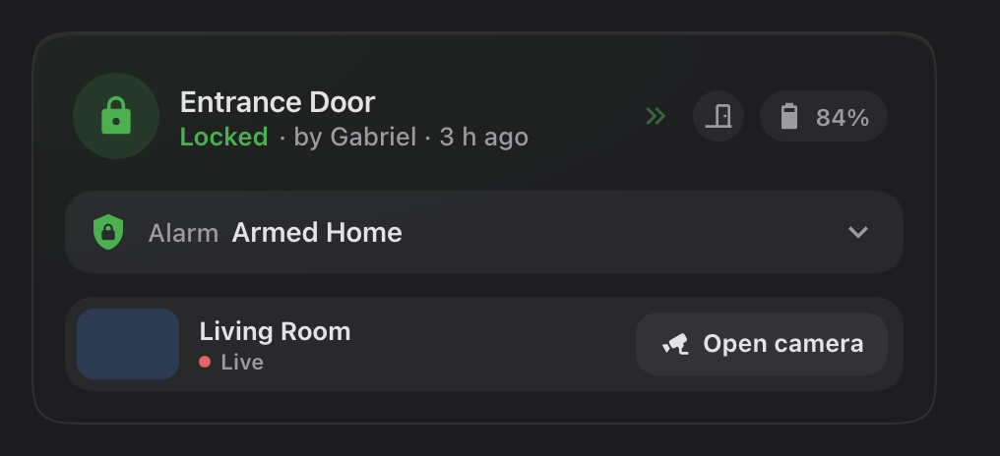</picture>

A door lock. The lock's own icon is the handle: drag it across the row to do the opposite of what the lock
is now; a lock that can open has a second stop that has to be held until a ring fills. A tap only nudges
it, so nothing happens by accident. It shows the door contact, the battery, who changed it and when, and
can carry the house alarm and a camera.

<picture><source media="(prefers-color-scheme: light)" srcset="docs/images/lock-full-light.png">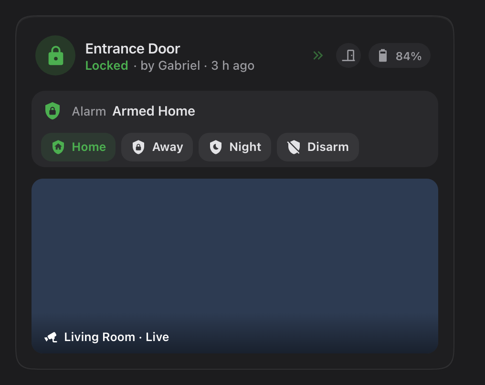</picture>

| Option | Type | Default | What it does |
|---|---|---|---|
| `entity` | entity | the settings' security entity, else the first lock | One lock. |
| `entities` | list | none | Several locks, each `{ entity, name, icon, door, battery, camera }`. Several get a row each, a summary and **Lock all**. |
| `area` | area or list | none | Every lock of these areas. |
| `include` | list of locks | none | Locks added to an area's (one with no area). |
| `exclude` | list of locks | none | Locks kept out of an area's. A lock you name is always shown. |
| `name`, `icon` | string | the lock's | Title and icon (for several locks, the card's title). |
| `layout` | `full` or `compact` | `full` | `compact`: one row per lock. A compact card keeps its camera away unless `camera_view` asks for one. |
| `door` | entity or `false` | found | The door contact: a binary sensor on the lock's device, or the only door sensor of its area. A locked lock with its door open is a warning. |
| `hide_door` | boolean | `false` | Same as `door: false`. |
| `battery` | entity or `false` | found | The battery sensor of the lock's device, as an icon by level and the percent. |
| `hide_battery` | boolean | `false` | Same as `battery: false`. |
| `battery_warn` | number (%) | `40` | Amber below this, red at 15. |
| `unlocked_warn` | number (min) | `15` | Minutes unlocked before "Unlocked for 25 min" nudges, with a **Lock now** button. `0`: never. |
| `alarm` | entity or `false` | the house's panel | The alarm: its state and the arm modes as buttons. Disarming, and any code, is Home Assistant's own dialog. |
| `hide_alarm` | boolean | `false` | Same as `alarm: false`. |
| `alarm_view` | `compact`, `full`, `hidden` | `compact` | `compact`: one line, a chevron slides the arm modes open. `full`: always there. |
| `camera` | entity or `false` | a camera in the lock's area | The camera. |
| `hide_camera` | boolean | `false` | Same as `camera: false`. |
| `camera_view` | `compact`, `full`, `hidden` | `compact` | `compact`: a slim row and an **Open camera** button. `full`: a live still. Both open the camera card in a popup. |
| `chips` | chips | none | Your own chips, under the lock. |
| `state_glow` | boolean | `true` | A soft glow in the card's corner in what it is doing (a lit light, a locked door, music playing). `false` keeps the card plain. |
| `title_path` | string | none | Title link: tapping the header opens this page. Setting it (or `title`) shows the header on a single lock too. Only the words are the link. |

Tap a lock's name for its details. From the keyboard, focus the icon and use the arrow keys; hold Enter
to open.

<picture><source media="(prefers-color-scheme: light)" srcset="docs/images/lock-several-light.png">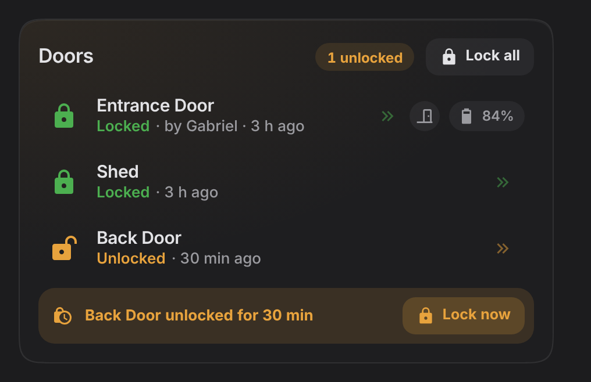</picture>

Minimum:

```yaml
type: custom:savvy-lock-card
entity: lock.front_door
```

Full:

```yaml
type: custom:savvy-lock-card
entities:
  - entity: lock.front_door
    name: Front door
    door: binary_sensor.front_door
    battery: sensor.front_door_battery
    camera: camera.porch
  - lock.back_door
name: Doors
layout: full
battery_warn: 40
unlocked_warn: 15
alarm: alarm_control_panel.home
alarm_view: compact
camera_view: compact
chips:
  - entity: script.lock_everything
```

---

### Vacuum

<picture><source media="(prefers-color-scheme: light)" srcset="docs/images/vacuum-light.png"></picture>

Any robot vacuum, deepest for Roborock. Everything is found from the vacuum's device: the live job, map,
rooms (cleaned in the order you tap them), routines, modes, dock and consumables. Hold Stop to stop and
hold "Clean N rooms" to start, so neither happens by accident.

<picture><source media="(prefers-color-scheme: light)" srcset="docs/images/vacuum-compact-light.png"></picture>

| Option | Type | Default | What it does |
|---|---|---|---|
| `entity` | entity | **required** | The vacuum. |
| `name` | string | the entity's | Title. |
| `layout` | `full` or `compact` | `full` | `compact`: one row with a start / pause button; hold it to send the vacuum home. |
| `start` | entity | the vacuum's own start | What Start runs: a button, script or scene. Resume after a pause is always a real resume. |
| `start_name` | string | `Start` | Start's label. |
| `navigation_path` | string | none | Tapping the name opens this page. |
| `map` | `popup`, `inline`, `off`, or an image/camera entity | `popup` | Where the map shows. |
| `map_max_height` | number (px) | none | Cap the map's height. |
| `rooms` | `auto`, `off`, or list | `auto` | Your areas when mapped, else the robot's rooms. A list limits, orders or renames. |
| `routines` | `auto`, `off`, or list | `auto` | Your app routines. A list is `[{ entity, name, icon }]`. |
| `modes`, `dock`, `maintenance`, `stats` | `auto` or `off` | `auto` | `off` hides a part. |
| `hide_modes` | list | none | Mode selects to leave out. |
| `exclude` | list of entities | none | Discovered entities to leave out. |
| `battery_warn`, `battery_critical` | number (%) | `20`, `10` | The battery ring turns amber or red below these. |
| `state_glow` | boolean | `true` | A soft glow in the card's corner in what it is doing (a lit light, a locked door, music playing). `false` keeps the card plain. |
| `title_path` | string | none | Title link: tapping the name opens this page. Only the words are the link. `title` writes the name, like `name`. |

Minimum:

```yaml
type: custom:savvy-vacuum-card
entity: vacuum.robot
```

Full:

```yaml
type: custom:savvy-vacuum-card
entity: vacuum.robot
name: Robot
layout: full
start: script.vacuum_quick_clean
start_name: Quick clean
navigation_path: /lovelace/vacuum
map: popup
map_max_height: 420
rooms: [kitchen, living_room]
routines:
  - entity: button.vacuum_routine_evening
    name: Evening
    icon: mdi:weather-night
modes: auto
dock: auto
maintenance: auto
stats: off
hide_modes: [select.vacuum_water_level]
exclude: [sensor.vacuum_last_error]
battery_warn: 20
battery_critical: 10
```

---

### Scenes

<picture><source media="(prefers-color-scheme: light)" srcset="docs/images/scene-light.png"></picture>

Every scene of a room as a tile. Tap runs it, hold opens its details. A scene lights up for a few seconds
after it runs, from here or from anywhere else.

| Option | Type | Default | What it does |
|---|---|---|---|
| `area` | area or list | none | The areas whose scenes to show. Hidden or disabled scenes are left out. |
| `title` | string | none | A heading over the tiles. |
| `layout` | `full` or `compact` | `full` | `compact`: one scrolling row of pills. |
| `columns` | number 1-6 | 2 to 4 by width | Tiles per row. |
| `entities` | list | none | Pinned scenes, first and in order, even from outside the area. A string, or `{ entity, name, icon, color }`. |
| `auto_discover` | boolean | `true` | Also the area's scenes, after the pinned ones. |
| `exclude` | list of scenes | none | Scenes never shown. |
| `strip` | regular expression or `false` | the area's name | Taken out of every name (any case, every match); then the area's name is taken off the front. `false`: names stay whole. A pinned scene's own `name` is used as written. |
| `color` | colour | `blue` | The tint. |
| `show_icon` | boolean | `true` | The icons. |
| `navigation_path` | string | none | Tapping the title goes there. |
| `title_path` | string | none | Title link: tapping the title opens this page. Only the words are the link, so it replaces `navigation_path` (which links the whole header). |

Minimum:

```yaml
type: custom:savvy-scene-card
area: office
```

Full:

```yaml
type: custom:savvy-scene-card
area: [office, hallway]
title: Scenes
layout: full
columns: 3
entities:
  - scene.office_focus
  - entity: scene.office_relax
    name: Relax
    icon: mdi:sofa
    color: amber
auto_discover: true
exclude: [scene.office_reading]
strip: '^.*//\s*|\s*-\s*on$'      # "Office // Work - On" reads "Work"
color: blue
show_icon: true
navigation_path: /lovelace/scenes
```

---

### Last check

<picture><source media="(prefers-color-scheme: light)" srcset="docs/images/last-check-light.png">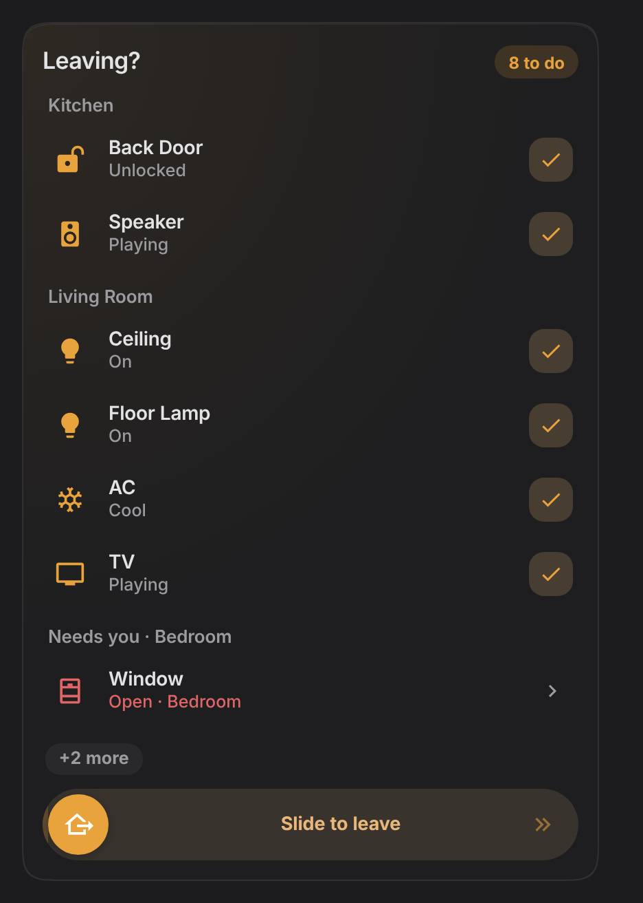</picture>

The last look before you leave, or before bed. It finds what would be left behind (lights on, music
playing, the A/C running, a door left unlocked, the garage open), lists it by room, and one slide turns it
all off. Each row has a tick to leave that one out this time. Open doors and windows can't be closed by a
service, so they stay on the list as things that need you. It never unlocks anything.

When the slide runs, every row turns to a tick as Home Assistant confirms it. A thing that is still on
after 8 seconds shows a retry. There is a `compact` layout with a one-line summary and the slide.

<picture><source media="(prefers-color-scheme: light)" srcset="docs/images/last-check-compact-light.png">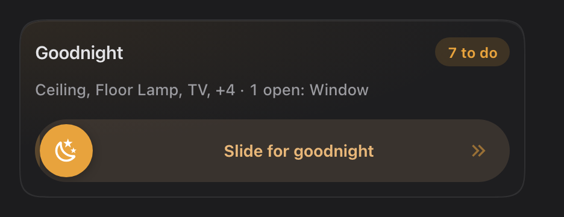</picture>

| Option | Type | Default | What it does |
|---|---|---|---|
| `mode` | `leave` or `goodnight` | `leave` | `leave` checks lights, players, climate, fans, locks, garage and gate. `goodnight` is the same without the climate. |
| `area` | area or list | the whole house | Only these areas are checked. |
| `title` | string | by mode | The heading ("Leaving?", "Goodnight"). |
| `title_path` | string | none | Title link: tapping the title opens this page. |
| `domains` | list | by mode | What to check instead: `light`, `media_player`, `climate`, `fan`, `lock`, `cover`, `switch`, `input_boolean`. A cover is only a garage or a gate. |
| `include` | list of entities | none | More things to turn off, any kind that can be turned off (a coffee machine's switch, say). |
| `exclude` | list of entities | none | Never touched or listed. The ignore list in the [Savvy settings](#savvy-settings) is added to it. |
| `blockers` | boolean | `true` | Open doors and windows are listed as things that need you. |
| `block` | boolean | `false` | `true` refuses to run while something needs you. |
| `then` | action or list | none | Runs after a clean run: a scene, a script, arming an alarm. |
| `slide_label` | string | by mode | The words on the slide. |
| `layout` | `full` or `compact` | `full` | `compact`: a summary line and the slide. |
| `max_rows` | number | `8` | Rows of things to turn off before "+N more". What needs you always shows. |
| `state_glow` | boolean | `true` | Amber while there is something to do, red when something needs you. |

Minimum:

```yaml
type: custom:savvy-last-check-card
```

Full:

```yaml
type: custom:savvy-last-check-card
mode: leave
area: [hallway, living_room, kitchen, bedroom]
title: Leaving?
domains: [light, media_player, climate, fan, lock, cover]
include: [switch.coffee_machine]
exclude: [light.hall_night_light]
blockers: true
block: false
slide_label: Slide to leave
layout: full
max_rows: 8
then:
  action: perform-action
  perform_action: alarm_control_panel.alarm_arm_away
  target:
    entity_id: alarm_control_panel.home_alarm
```

---

### Home story

<picture><source media="(prefers-color-scheme: light)" srcset="docs/images/story-light.png">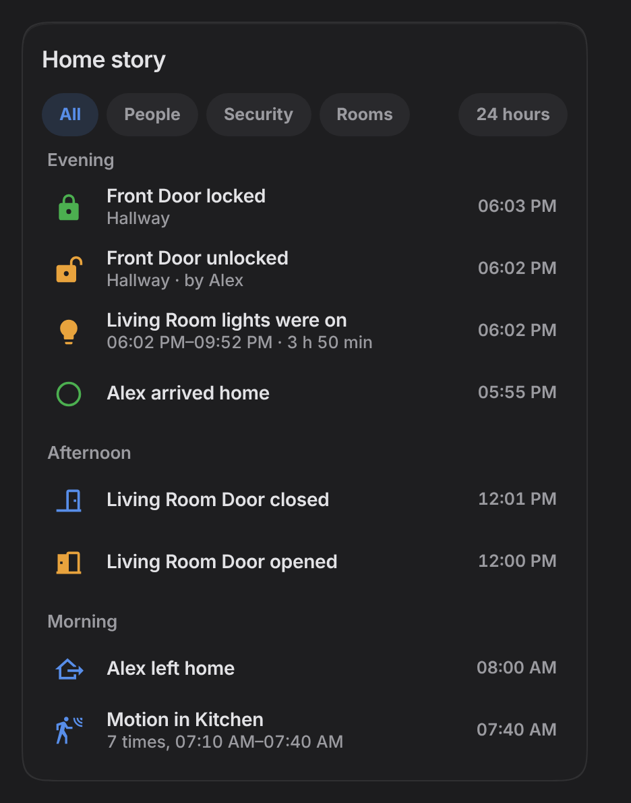</picture>

What happened at home, told in plain sentences instead of a logbook. A motion sensor that fired seven times
is one line; a room's lights are one span ("on 06:02 PM to 09:52 PM, 3 h 50 min"); a door unlocked from the
app says who did it; people arriving and leaving are in words. Lines are grouped by part of the day, newest
first. Tap a line for its details. Sensors, automations, updates and the like stay out. The chips filter
the story (All, People, Security, Rooms) and the last chip changes the range: today, the last 24 hours, or
**while you were away**, from the moment the last person left.

| Option | Type | Default | What it does |
|---|---|---|---|
| `range` | `today`, `24h` or `away` | `today` | The time window. `away` starts when the last person left (and ends when the first came back). |
| `area` | area or list | the whole house | Only these areas. People still show. |
| `title` | string | Home story | The heading. |
| `title_path` | string | none | Title link: tapping the title opens this page. |
| `people` | boolean | `true` | Arrivals and departures. |
| `filters` | boolean | `true` | The chips row. |
| `include` | list of entities | none | Things that are left out by default, for example a switch. |
| `exclude` | list of entities | none | Never shown. The ignore list in the [Savvy settings](#savvy-settings) is added to it. |
| `max_events` | number | `30` | Lines before "Show more". |
| `merge_minutes` | number | `20` | Repeats of one thing closer together than this are one line. |
| `layout` | `full` or `compact` | `full` | `compact`: one line each, no details. |

The card reads the logbook (and, for `away`, the people's history) through Home Assistant, refreshes every
minute while it is on screen, and only asks for the kinds of things it shows.

Minimum:

```yaml
type: custom:savvy-story-card
```

Full:

```yaml
type: custom:savvy-story-card
range: today
area: [hallway, kitchen, living_room]
title: Home story
people: true
filters: true
include: [switch.coffee_machine]
exclude: [light.hall_night_light]
max_events: 30
merge_minutes: 20
layout: full
```

---

### Covers

<picture><source media="(prefers-color-scheme: light)" srcset="docs/images/cover-light.png">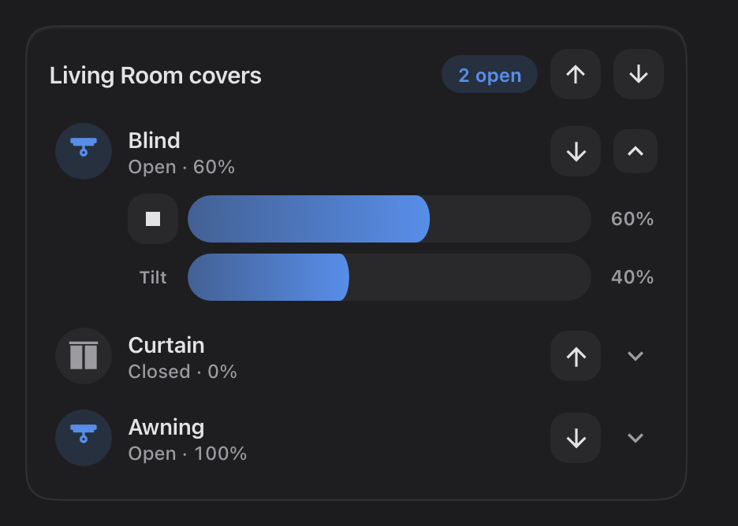</picture>

The blinds, shutters, curtains, awnings, garage and gate of a room, one row each. These are the same rows
the covers popup of the home header uses: open, close or stop on the line, and behind the chevron a position
bar and, for slats, a tilt bar. **Open all** and **Close all** act on exactly what is listed. A garage door
or a gate asks for a second tap to open (the row says "Tap again to open"), and Open all leaves them out;
closing is always one tap. The same safety applies in the popup. Each row shows the cover's own icon from
Home Assistant (its `icon`, else the kind of cover and whether it is open); `covers` gives one a different
name or icon. With `controls: slider` the position bar sits on the row itself.

<picture><source media="(prefers-color-scheme: light)" srcset="docs/images/cover-sliders-light.png">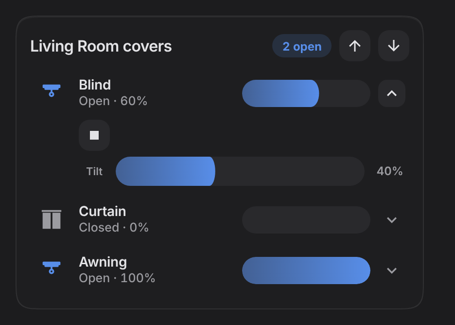</picture>

<picture><source media="(prefers-color-scheme: light)" srcset="docs/images/cover-compact-light.png">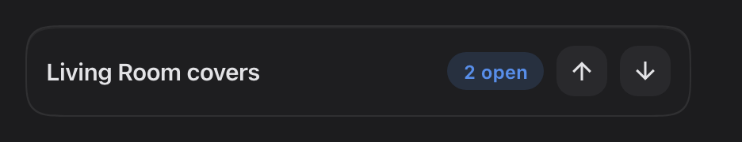</picture>

| Option | Type | Default | What it does |
|---|---|---|---|
| `area` | area or list | every cover of the house | The areas whose covers to show. With several areas the rows are grouped by room. |
| `title` | string | the area's name + "covers" | The heading. |
| `title_path` | string | none | Title link: tapping the title opens this page. |
| `classes` | list | all | Only these kinds: `blind`, `shutter`, `curtain`, `awning`, `shade`, `garage`, `gate`, `door`, `window`. |
| `include` | list of covers | none | Covers to add that the area or kinds would leave out. |
| `exclude` | list of covers | none | Never shown. The ignore list in the [Savvy settings](#savvy-settings) is added to it. |
| `controls` | `arrows` or `slider` | `arrows` | `slider`: the position bar sits on each row, where the arrow was. A cover with no position (a garage door, a gate) keeps its arrow. |
| `covers` | list | none | `{ entity, name, icon }`: a cover with its own name and icon instead of Home Assistant's. Listed covers are always shown. |
| `all` | boolean | `true` | The Open all / Close all buttons (only with more than one cover). `false` hides them. |
| `layout` | `full` or `compact` | `full` | `compact`: the summary and the two buttons, no rows. |
| `state_glow` | boolean | `true` | A soft amber glow while a garage door or a gate is open. |

Minimum:

```yaml
type: custom:savvy-cover-card
area: living_room
```

Full:

```yaml
type: custom:savvy-cover-card
area: [living_room, bedroom]
title: Blinds
title_path: /lovelace/covers
classes: [blind, shutter, curtain]
controls: slider
covers:
  - entity: cover.living_room_blind
    name: Lounge blind
    icon: mdi:blinds-horizontal
include: [cover.patio_awning]
exclude: [cover.guest_blind]
all: true
layout: full
```

---

### People

<picture><source media="(prefers-color-scheme: light)" srcset="docs/images/people-light.png">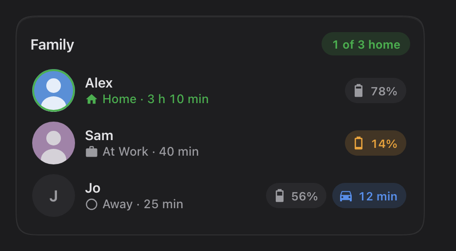</picture>

Who is home. Each person has an avatar with a green ring when they are home, where they are ("Home · 3 h",
"At Work · 40 min", "Away · 25 min"), the phone's battery (amber under 20 %, red at 10 %) and, while they
are away, how long until they are home. The battery is found through the person's phone, with no setup.
The way home needs a sensor from you (a travel time sensor): minutes, or a time. Home comes first, then the
others by name. The icon of the place they are at (the zone's own) sits beside the words. Tap a person for
their details; the map is there.

<picture><source media="(prefers-color-scheme: light)" srcset="docs/images/people-horizontal-light.png">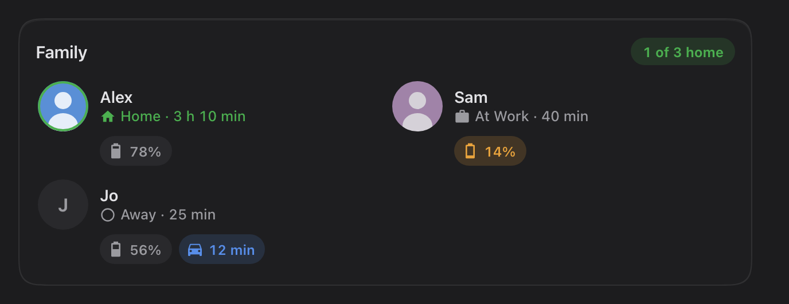</picture>

<picture><source media="(prefers-color-scheme: light)" srcset="docs/images/people-compact-light.png">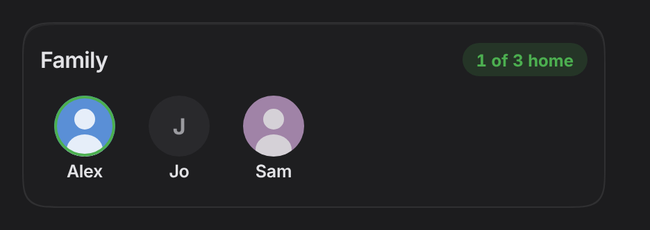</picture>

| Option | Type | Default | What it does |
|---|---|---|---|
| `people` | list | every person | `person.x`, or `{ entity, name, eta, battery }`. A list keeps its order. |
| `title` | string | People | The heading. |
| `title_path` | string | none | Title link: tapping the title opens this page. |
| `battery` | boolean | `true` | The phone's battery. `false` hides it. On a person, `battery` is a sensor, or `false`. |
| `battery_warn` | number | `20` | Amber below this percentage. |
| `eta` | entity | none | A sensor with the time to get home, for everyone. On a person it is theirs. |
| `exclude` | list of people | none | Never shown. The ignore list in the [Savvy settings](#savvy-settings) is added to it. |
| `layout` | `full` or `compact` | `full` | `compact`: a row of avatars with their names. |
| `direction` | `vertical` or `horizontal` | `vertical` | With the full layout: one person under the other, or side by side (wrapping when the card is narrow). |

Minimum:

```yaml
type: custom:savvy-people-card
```

Full:

```yaml
type: custom:savvy-people-card
title: Family
people:
  - person.alex
  - entity: person.sam
    name: Sam
    battery: sensor.sam_phone_battery
    eta: sensor.sam_travel_time
battery: true
battery_warn: 20
exclude: [person.guest]
layout: full
```

---

### Fans

<picture><source media="(prefers-color-scheme: light)" srcset="docs/images/fan-light.png">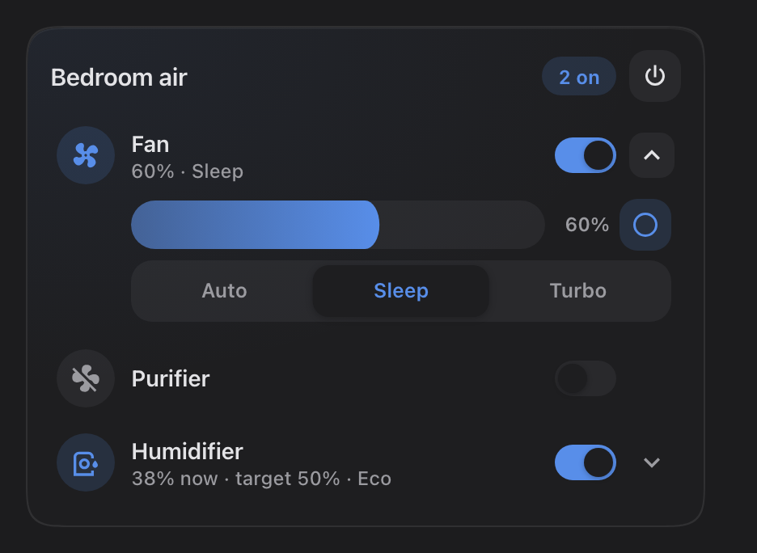</picture>

The fans, air purifiers and humidifiers of a room, one row each: the same rows the popups use. The switch is
on the line; behind the chevron a fan has its speed, its preset modes and oscillation, and a humidifier its
target humidity and modes (the line says the humidity now). A fan's icon turns while it runs, faster at a
higher speed. **All off** turns off exactly what is listed.

<picture><source media="(prefers-color-scheme: light)" srcset="docs/images/fan-compact-light.png">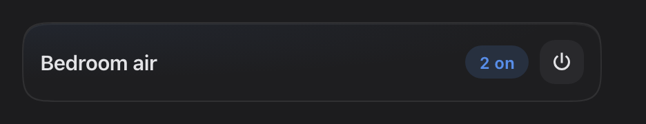</picture>

| Option | Type | Default | What it does |
|---|---|---|---|
| `area` | area or list | the whole house | The areas whose fans to show. With several areas the rows are grouped by room. |
| `title` | string | the area's name + fans or air | The heading. |
| `title_path` | string | none | Title link: tapping the title opens this page. |
| `kinds` | list | `[fan, humidifier]` | Which kinds to list. Air purifiers are fans. |
| `include` | list of entities | none | Entities to add that the area or kinds would leave out. |
| `exclude` | list of entities | none | Never shown. The ignore list in the [Savvy settings](#savvy-settings) is added to it. |
| `all` | boolean | `true` | The All off button. `false` hides it. |
| `layout` | `full` or `compact` | `full` | `compact`: the summary and the button, no rows. |
| `state_glow` | boolean | `true` | A soft glow while anything is on. |

Minimum:

```yaml
type: custom:savvy-fan-card
area: bedroom
```

Full:

```yaml
type: custom:savvy-fan-card
area: [bedroom, office]
title: Air
title_path: /lovelace/air
kinds: [fan, humidifier]
include: [fan.hallway_extractor]
exclude: [fan.guest_room_fan]
all: true
layout: full
```

---

### Energy

<picture><source media="(prefers-color-scheme: light)" srcset="docs/images/energy-light.png">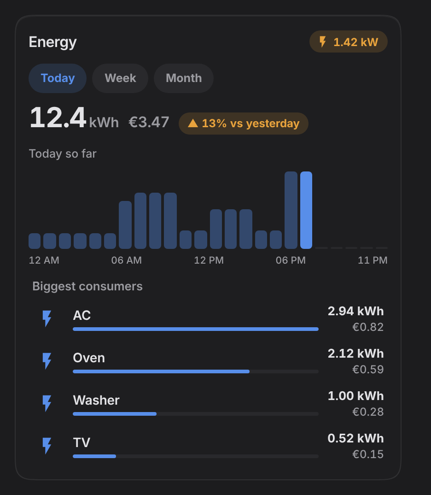</picture>

What the house used, what it cost and where it went. Today, this week or this month (the chips under the
title), against the same stretch before it (today so far against the same hours of yesterday, so the
comparison is fair), a bar for every hour or day, the live power, and the biggest consumers. The cost is
each hour's energy times that hour's price, so a tariff that changes through the day is counted properly.
Tap a bar to see that hour or day, tap it again to let go. Tap a consumer for its details.

<picture><source media="(prefers-color-scheme: light)" srcset="docs/images/energy-week-light.png">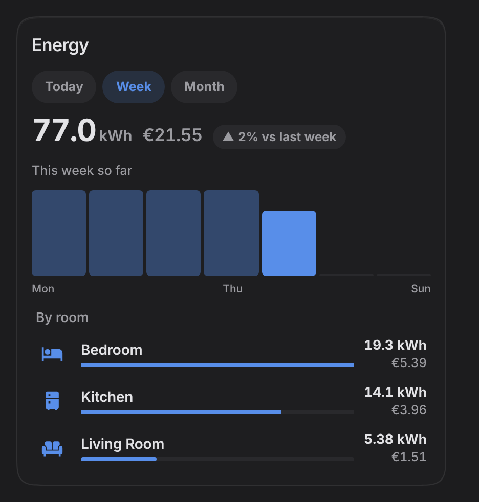</picture>

The card reads Home Assistant's long-term statistics. An energy sensor needs a state class (`total_increasing`
or `total`) and the unit kWh, Wh or MWh; the same sensors the Energy dashboard uses. The card stores nothing.

| Option | Type | Default | What it does |
|---|---|---|---|
| `total` | entity | the consumers' sum | The energy sensor of the whole house. **Set it when you have one**: without it the card adds up the consumers, and finding them automatically would count a whole-house sensor twice. |
| `consumers` | list of entities | every energy sensor found | The sensors to rank (and, with no `total`, to add up). |
| `power` | entity | none | A power sensor (W or kW) for the live reading. |
| `tariff` | entity | none | A sensor or input number with the price per kWh. Each hour's own average is used, so a tariff that changes through the day is counted properly; prices in cents are understood. |
| `price` | number | none | A fixed price per kWh, used when there is no `tariff` or it is unavailable. No price at all, no cost. |
| `currency` | string | Home Assistant's | The currency of the cost, e.g. `EUR`. |
| `range` | `today`, `week` or `month` | `today` | The period shown first. |
| `by` | `device` or `room` | `device` | What the ranking adds up. |
| `max_consumers` | number | `5` | Rows in the ranking. |
| `area` | area or list | all | Only the consumers of these areas. |
| `exclude` | list of entities | none | Never ranked. The ignore list in the [Savvy settings](#savvy-settings) is added to it. |
| `title` | string | Energy | The heading. |
| `title_path` | string | none | Title link: tapping the title opens this page. |
| `layout` | `full` or `compact` | `full` | `compact`: the numbers only, no chart or ranking. |

Minimum:

```yaml
type: custom:savvy-energy-card
total: sensor.house_energy
```

Full:

```yaml
type: custom:savvy-energy-card
total: sensor.house_energy
consumers:
  - sensor.kitchen_oven_energy
  - sensor.living_room_tv_energy
  - sensor.bedroom_ac_energy
power: sensor.house_power
tariff: sensor.electricity_tariff
price: 0.28                           # used when the tariff is unavailable
currency: EUR
range: today
by: device
max_consumers: 5
exclude: [sensor.guest_room_energy]
layout: full
```

---

### System health

<picture><source media="(prefers-color-scheme: light)" srcset="docs/images/system-health-light.png"></picture>

What needs attention, in three sections: **offline devices**, **low batteries**, and, if you use
[Watchman](https://github.com/dummylabs/thewatchman), the missing entities and actions it found.

How it counts:

- A device is one issue, however many entities it has. It counts as offline when half or more of its
  entities are unavailable.
- A hub or bridge takes the devices behind it along when it is offline ("Zigbee2MQTT Bridge offline, 34
  devices"). Home Assistant records which device sits behind which hub, so nothing is guessed from names.
- An integration is one issue when its setup failed or is retrying, or when most of its devices are offline.
- A Watchman item whose entity belongs to a device that is already an issue is folded into that device
  ("2 dashboard references broken") and counts once.
- Known problems under `ignore` leave every count and wait in a collapsed "Known" line. They are shared by
  everyone and set in YAML or the settings card.
- A **dismiss button** on each row puts it aside for you: it leaves every count (the card's and the home
  header's cog) and waits in a collapsed "Dismissed" line at the foot of its category, with a Bring back
  button. It is personal, kept in your Home Assistant profile (so it follows you to your other devices;
  without one, in that browser), and it forgets itself when the problem is gone, so it returns if it breaks
  again. A problem that gets bigger (one more entity goes down) comes back too.

<picture><source media="(prefers-color-scheme: light)" srcset="docs/images/system-health-dismissed-light.png">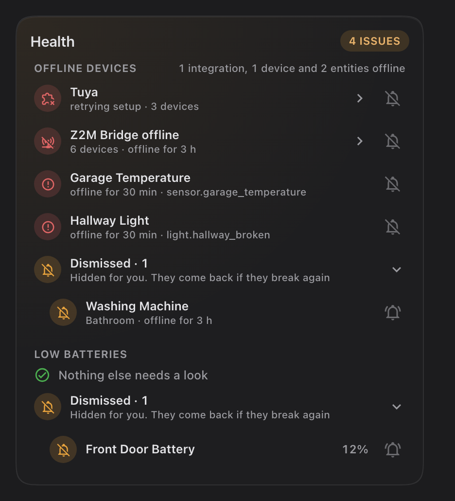</picture>

<picture><source media="(prefers-color-scheme: light)" srcset="docs/images/system-health-columns-light.png">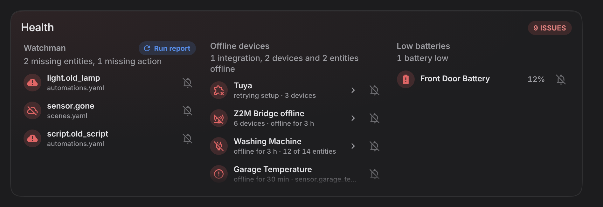</picture>

| Option | Type | Default | What it does |
|---|---|---|---|
| `source` | `all`, `battery`, `unavailable` (or `offline`), `watchman` | `all` | Everything, or one list. |
| `title` | string | per source | Title. |
| `details` | boolean | `false` | A line of facts under each section, and area and integration on the rows. |
| `group_by` | `hub`, `device`, `none` | `hub` | How offline entities become issues. |
| `group_min` | number | `3` | How many devices a hub or integration needs before they roll up into it. |
| `startup_wait` | boolean | `true` | While Home Assistant (or an integration) is still starting, show a loading state instead of every offline device: a loading ring in place of the home header's cog, and "Home Assistant is starting…" in the card, with Show anyway. It follows the connection, the core's own state and the integrations whose setup is in progress, never a timer. |
| `battery_threshold` | number (%) | `20` | A battery below this is low. |
| `exclude_platforms` | list | `[mobile_app]` | Integrations to ignore. |
| `watchman` | list of entities | none | Watchman's summary sensors. |
| `watchman_button` | boolean | `true` | The **Run report** chip. Shows only when `watchman.report` exists. |
| `watchman_report` | object | `{ parse_config: true }` | The data the chip sends to `watchman.report`. |
| `watchman_last_run` | entity or `false` | found | Watchman's last-parse timestamp ("Checked 2 h ago"). |
| `ignore` | object | none | Known problems: `{ devices: [device ids], entities: [entity ids] }`. |
| `dismiss` | boolean | `true` | The dismiss button on each row. `false` hides the buttons; what was dismissed stays dismissed, listed in the Dismissed section at the bottom with its Bring back button. |
| `warn_above` | number | `6` | The count turns red at this many issues. |
| `categories` | list | all four | Which sections show and in what order: `watchman`, `unavailable`, `battery`, `dismissed`. Hidden sections still count. Dismissed goes last unless you place it. |
| `columns` | number | automatic | With `source: all`, how many sections sit side by side when the card is wide. `1` stacks them. |
| `max_rows` | number | `7` | Rows before a list scrolls. |
| `show_all_batteries` | boolean | `true` | With `source: battery`: every battery, low ones first. |
| `action` | object | none | A footer button `{ label, tap_action }`. Shown only when `tap_action` is a real action. |
| `state_glow` | boolean | `true` | A soft glow in the card's corner in what it is doing (a lit light, a locked door, music playing). `false` keeps the card plain. |
| `title_path` | string | none | Title link: tapping the title opens this page. Only the words are the link. |

Minimum:

```yaml
type: custom:savvy-system-health-card
```

Full:

```yaml
type: custom:savvy-system-health-card
source: all
title: System health
details: true
group_by: hub
group_min: 3
battery_threshold: 20
warn_above: 6
exclude_platforms: [mobile_app]
watchman: [sensor.watchman_missing_entities, sensor.watchman_missing_actions]
watchman_button: true
watchman_report: { parse_config: true }
ignore:
  devices: [3f9c2a7e1d4b4a0e9c1d]
  entities: [sensor.bedroom_thermostat_battery]
dismiss: true
columns: 3
max_rows: 7
action:
  label: Open admin
  tap_action: { action: navigate, navigation_path: /lovelace/admin }
```

---

### Entity

<picture><source media="(prefers-color-scheme: light)" srcset="docs/images/entity-light.png"></picture>

One entity and the ones that belong with it. A person gets their picture and zone ("Home, for 3 h");
anything else its icon, state and how long. Chips underneath toggle, press or show a value.

| Option | Type | Default | What it does |
|---|---|---|---|
| `entity` | entity | **required** | The main entity. |
| `name`, `icon` | string | the entity's | Its look. |
| `color` | colour | the entity's own | The colour of the icon and of the card's glow while it is on: a colour name or hex. Empty: the entity's own (a light's colour, a kind's), else a neutral glow. |
| `picture` | string | the person's | A picture URL, instead of the person's own. |
| `show_state` | boolean | `true` | The state. |
| `show_since` | boolean | `true` | How long it has been so. |
| `navigation_path` | string | none | Where a tap goes. Without it a tap does what the entity does: a light, switch, fan or automation toggles, a button presses, a script or scene runs, anything else (a person, a sensor) opens more-info. |
| `tap_action`, `hold_action`, `double_tap_action` | action | by domain, hold: more-info | The main entity's gestures. |
| `chips` | chips | none | The entities that belong with it. |
| `state_glow` | boolean | `true` | A soft glow in the card's corner in what it is doing (a lit light, a locked door, music playing). `false` keeps the card plain. |
| `title_path` | string | none | Title link: tapping the name opens this page. Only the words are the link; the rest of the card keeps its own tap. `title` writes the name, like `name`. |

Minimum:

```yaml
type: custom:savvy-entity-card
entity: person.sam
```

Full:

```yaml
type: custom:savvy-entity-card
entity: person.sam
name: Sam
icon: mdi:account
color: blue
picture: /local/sam.jpg
show_state: true
show_since: true
navigation_path: /lovelace/people
chips:
  - entity: switch.charger_plug
    name: Charger
  - entity: sensor.phone_battery
    name: Phone
```

---

### Graph

<picture><source media="(prefers-color-scheme: light)" srcset="docs/images/graph-light.png"></picture>

Tiles that know what they are. A number gets a graph with minimum, maximum, average and a scrub bubble;
anything else a small tile with its state. Past a week it reads long-term statistics.

| Option | Type | Default | What it does |
|---|---|---|---|
| `entities` | list | **required** | The tiles, see below. |
| `title` | string | none | Title. |
| `hours_to_show` | number | `24` | Every graph's range, unless a tile sets its own. |
| `ranges` | list of hours | none | An hours selector in the header, e.g. `[24, 168, 720]`. |
| `columns` | number | automatic | Small tiles per row. |
| `title_path` | string | none | Title link: tapping the title opens this page. Only the words are the link. |

Each tile in `entities`:

| Option | Type | Default | What it does |
|---|---|---|---|
| `entity` | entity | **required** | What to show. |
| `attribute` | string | none | Chart this attribute instead of the state. |
| `name`, `icon`, `unit` | string | the entity's | Override what the tile shows. |
| `hours_to_show` | number | the card's | This tile's own range. |
| `thresholds` | list or preset | none | Colours the graph by value, see [Colours](#graph-colours). |
| `smooth` | boolean | `false` (`true` for the `temperature` preset) | Blend between the thresholds' colours instead of switching at each one. |
| `color` | colour | accent | One colour for the whole graph, when there are no thresholds. |
| `state_color` | boolean | `false` | Colours an on/off tile green or red. |
| `tap_action`, `hold_action` | action | none | What a tap or hold does. |

<a id="graph-colours"></a>
**Colours.** `thresholds` is a list of `{ value, color }` (or `{ value, level }`), where the colour starts at
that value. `color` is an HA colour name (`blue`, `orange`, `deep-orange`...), a hex value or `rgb(...)`.
`level` is the old `good` / `warn` / `bad`, and still works. Below the first threshold the graph keeps
its own colour.

A preset writes the whole scale for you: `thresholds: temperature` runs blue, teal, green, amber, red
(set in °C, converted for a °F sensor and smooth by default), `humidity` is amber when dry, green, amber and red
when damp, and `battery` is red, amber, green. In the editor, the Colour scale list has the preset select and an
Add threshold button.

Minimum:

```yaml
type: custom:savvy-graph-card
entities:
  - sensor.server_cpu
```

Full:

```yaml
type: custom:savvy-graph-card
title: System
hours_to_show: 24
ranges: [24, 168, 720]
columns: 2
entities:
  - entity: sensor.server_cpu
    name: CPU
    unit: "%"
    hours_to_show: 48
    thresholds:                       # steps in the old good / warn / bad levels
      - { value: 0, level: good }
      - { value: 60, level: warn }
      - { value: 85, level: bad }
  - entity: sensor.living_room_temperature
    thresholds: temperature           # blue to red, blended
  - entity: sensor.freezer_temperature
    smooth: true                      # your own colours, blended between them
    thresholds:
      - { value: -25, color: blue }
      - { value: -15, color: teal }
      - { value: -5, color: "#ff7043" }
  - entity: sensor.power
    color: purple                     # one colour, no thresholds
  - entity: weather.home
    attribute: humidity
    name: Humidity
    icon: mdi:water-percent
  - entity: binary_sensor.internet
    state_color: true
```

---

### Savvy settings

<picture><source media="(prefers-color-scheme: light)" srcset="docs/images/settings-light.png">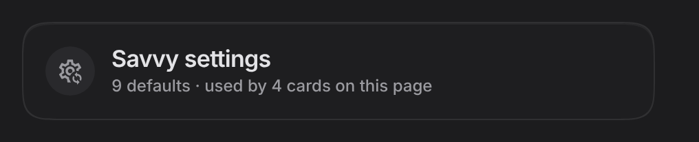</picture>

The defaults every other card shares: your pages, house mode, health options and each room's helpers.
Place it once on any page. In view mode it is a small status card (how many defaults, how many cards on
this page use them). The cards read the dashboard's own config to find it, keep the last answer in the
browser, and follow it live while you edit. With two settings cards the first is used.

| Option | Type | Default | What it does |
|---|---|---|---|
| `pages` | object | found by name | `home`, `lights`, `climate`, `media`, `security`, `health`: the page each home header chip, the cog and the home button lead to. `room`: a pattern for room pages (`/lovelace/{slug}`). `lights`, `climate`, `media`, `security` and each room's page are found by view name when left out; `false` turns one off. |
| `house` | object | none | `control` (the home header's control chip), `weather`, `security` (an entity for the security chip instead of the alarm), `tap` (`list`: a tap opens the popup; `navigate`: a tap goes to the chip's page and hold opens the popup). |
| `health` | object | none | `watchman`, `battery_threshold`, `warn_above`, `exclude_platforms`, `group_by`, `group_min`, `watchman_last_run`, `startup_wait`, and `ignore` (`{ devices, entities }`). Used by the card and the home header's cog. |
| `ignore` | object | none | `entities`: left out of everything the cards discover (room headers, section titles, tiles, room activity, locks, lights, scenes, vacuums) and the home header counts; `areas`: left out of the home header counts. A card that names an entity still shows it. |
| `aggregate` | `true` or list of kinds | off | See [Aggregate sensors](#aggregate-sensors). |
| `admin_only` | list or `true` | none | `health_cog`, `health_badges`: kept from people who are not administrators (the health cog in the home header, and the count on it). Everyone sees everything unless it is listed. A card can only hide itself, not lock a page: someone who types the address still reaches the page. A card's own `admin_only` wins. |
| `room_order` | list of areas | by name | Order of rooms in the popups and on the room header. |
| `rooms` | object | none | Per area: `name`, `icon`, `page`, `control`, `light_state` (the helper behind the lights card's pill and the room tile's toggle), `temperature`, `humidity`, `include`, `exclude`. |
| `layout` | `full` or `compact` | `full` | `compact`: a single row. |
| `title` | string | Savvy settings | The card's name. It has no link: the card goes nowhere. |

What each card takes from it:

| Card | From the settings |
|---|---|
| Home header | `control`, `weather`, home button, each chip's page and `tap`, the security entity, `ignore`, `room_order`, `aggregate`, `admin_only`, the cog's page and health options |
| System health | the health options, including known problems |
| Room header | the room's `control`, `temperature`, `include`, `exclude`; home button, room pages, `room_order`, `ignore.entities`, `aggregate` |
| Section title | the room's `name`, `icon`, `control`, `temperature`, `include`, `exclude`, page; `ignore.entities`, `aggregate` |
| Room tile | the room's `name`, `icon`, `control`, `temperature`, light helper (`toggle`), page; `ignore.entities`, `aggregate` |
| Room activity | the room's `include`, `exclude`; `ignore.entities`, `aggregate` |
| Lights | the room's light helper (the pill's toggle); `ignore.entities` |
| Climate | the room's `temperature` and `humidity` |
| Lock | the security entity (as the lock, when none is named); the room's `include`, `exclude`; `ignore.entities` |
| Scenes, Vacuum | `ignore.entities` |

Minimum:

```yaml
type: custom:savvy-settings-card
pages:
  home: /lovelace/home
```

Full:

```yaml
type: custom:savvy-settings-card
layout: full
pages:
  home: /lovelace/home
  lights: /lovelace/lights
  climate: /lovelace/climate
  media: /lovelace/media
  security: /lovelace/security
  health: /lovelace/admin
  room: /lovelace/{slug}
house:
  control: input_select.house_mode
  weather: weather.home
  security: alarm_control_panel.home
  tap: navigate
health:
  watchman: [sensor.watchman_missing_entities]
  battery_threshold: 20
  warn_above: 6
  exclude_platforms: [mobile_app]
  group_by: hub
  group_min: 3
  ignore:
    devices: [3f9c2a7e1d4b4a0e9c1d]
    entities: [sensor.bedroom_thermostat_battery]
ignore:
  entities: [light.garden_string]
  areas: [garage]
aggregate: true
admin_only: [health_cog, health_badges]
room_order: [living_room, kitchen, bedroom]
rooms:
  kitchen:
    name: Kitchen
    icon: mdi:silverware-fork-knife
    page: /lovelace/kitchen
    control: input_select.kitchen_scene
    light_state: switch.kitchen_lights
    temperature: sensor.kitchen_temperature
    humidity: sensor.kitchen_humidity
    include: [lock.back_door]
    exclude: [binary_sensor.hallway_motion]
```

---

## Shared options

### Design

Every card takes `design: glass`, `design: matte` or `design: plain`. Empty follows the dashboard's `design.style` in the [settings card](#savvy-settings); plain is the default. See [Glass](#glass) and [Matte](#matte).

### Grid heights

In a sections view, every card rounds its height up to whole grid rows (Home Assistant's 56px rows and 8px
gaps), so cards side by side end together. A card given `grid_options: { rows: n }` keeps the height Home
Assistant gives it, and `grid_snap: false` turns it off for one card.

### Chips

One chip format everywhere: `entity`, `name`, `icon`, `color` (a Home Assistant colour name or hex),
`show_state`, and `tap_action`, `hold_action`, `double_tap_action` in Home Assistant's action format. A
chip's defaults follow its domain: a switch toggles, a button presses, a select opens a picker.
`tap_action: { action: list }` is Savvy's own action and opens the list popup.

### Badges

The home header, room header, section title and room tile show what a room has. `entities` pins yours.
With `auto_discover` on (the default) the area's own join them: presence and doors always, and media,
locks, climate, fans, covers, windows, leaks and smoke while they are active.

What is relevant comes first, and the order follows the states as they change:

1. On the room tile, the room's lights toggle (`toggle`, or the settings' `light_state`), so it is always in the same place to tap.
2. Everything active: a tripped leak or smoke alarm, then presence, then an open door, then the rest.
3. Everything idle: presence, then the door, then the rest.

So when nobody is in the room and the door is shut, the TV that is playing comes first.

| Option | Type | Default | What it does |
|---|---|---|---|
| `entities` | chips | none | Pinned badges, always shown, in the order above. Never merged or ignored. |
| `auto_discover` | boolean | `true` | Add what the area has. `false` leaves the pinned ones and the temperature. |
| `exclude_kinds` | list of kinds | none | Kinds never discovered. |
| `include` | list of entities | none | Entities to treat as in this area (a lock with no area). |
| `exclude` | list of entities | none | Entities never discovered. The settings' `ignore.entities` and the room's `exclude` are added to it; `exclude: false` opts out. |

On the section title the temperature ends the row.

### Popups

<picture><source media="(prefers-color-scheme: light)" srcset="docs/images/popup-media-light.png"></picture>

Hold a chip on the home header, a room's light chip or a room tile and the entities behind it open. Every
row is one line: the entity, its main control, and a chevron that opens one extra line (media transport and
volume, a climate unit's modes, a light's brightness bar). Tapping a row's name opens its more-info. Lock
rows use the same slide handle as the [lock card](#lock).

- **Bulk action.** One button for what the popup lists: All off, Pause all, Lock all. It touches only what
  still needs it. `bulk_action: false` hides it.
- **Sort.** Rooms in your `room_order`, then by name. A Room | Recent switch lists by last change.
- **Ignore.** `exclude` and `exclude_areas` on a home header chip leave things out of both the count and the popup.
- **Security popup.** The alarm and locks stay on top, then what is open, leaks and smoke, and read-only
  presence and motion.

### Aggregate sensors

Some rooms have several presence sensors (cameras, motion, mmWave) and the lists get long. With
`aggregate: true`, in the settings card or on one card, each room's presence, motion and occupancy sensors
show as one "Presence" item: occupied if any one is, and since the first of those that are on came on. A
list of kinds (`[presence, door, window, leak, smoke, gas]`) merges those too. Sensors on your ignore lists
and entities you pinned yourself are never merged. In the security popup the merged row's chevron lists the
sensors behind it.

### Ignoring entities

`ignore.entities` in the settings card keeps entities out of everything the cards discover. A chip's
`exclude` does the same for one home header chip, and a card's `exclude` for that card. An entity you name
on a card (`entity`, `entities`, `video`, `lights`) is always shown.

### Icons

An entity's own icon wins, then the one in its registry entry, then a built-in table by domain, device
class and state. Savvy never shows Home Assistant's bookmark placeholder.

### Title and link

Every card takes `title_path` (editor: *Title link*), a page that opens when you tap the card's title. It is
off by default, and only the words of the title are the link: the rest of the card keeps doing what it did.
A card that already shows a name makes that name the link. A card that shows none (home header, room header,
camera) draws a slim title line when you set `title`.

```yaml
type: custom:savvy-climate-card
area: living_room
title_path: /lovelace/climate
```

| Card | What the link is | `title` |
|---|---|---|
| Home header, Room header, Camera | A title line, drawn when `title` is set | The line's text |
| Lights, Scenes, System health, Graph | Their title | The title |
| Climate, Media, Vacuum, Entity, Room activity | Their name | Another way to write `name` |
| Lock | The header, shown for a single lock too when this is set | The header text |
| Section title | Its name (the same as `navigation_path`) | The same as `name` |
| Savvy settings | None | Replaces "Savvy settings" |
| Room tile | None: the whole tile already goes to its page | None |

## Troubleshooting

- **"Custom element doesn't exist: savvy-..."** The resource is not loaded. Check Settings, Dashboards,
  Resources for `savvy-cards.js` as a JavaScript module, then reload the browser. After an update a stale
  cache is the usual cause: change the `?v=` number, or clear the browser cache.
- **A card shows nothing for an area.** Check the area in Home Assistant: the entity or its device must be
  assigned to it. For things that have no area, name them on the card (`entity`, `include`).
- **The settings are not picked up.** There must be a settings card on the same dashboard, and only the
  first one counts. Open any card's editor: **From Savvy settings** lists what it inherits. To switch off
  an inherited home button or control, use `show_home: false` or `show_control: false`.
- **The page address does nothing.** Use the path as the browser shows it, starting with a slash
  (`/lovelace/lights`). Your dashboard's URL may not start with `/lovelace`.
- **No Run report chip.** It needs the Watchman integration's `watchman.report` action.
- **A lock won't open.** The slide's second stop only exists for locks that support `lock.open`.
- **Something looks wrong.** Open the browser console; the bundle prints its version when it loads.
  Please include it in an issue.

## Development

No dependencies, no bundler. `src/core/` is the shared engine and `src/cards/` has one file per card.
`node build.mjs` joins them into `dist/savvy-cards.js`, and `node build.mjs --check` fails when the
committed dist is stale. The design rules are in [docs/DESIGN.md](docs/DESIGN.md).

Tests need Playwright:

```
node test/run.mjs [filter]        # all specs, or those matching a name
node test/screenshots.mjs [name]  # redraw the README images
```

The tests run every card against a made-up house in `test/house.js`, in both themes and at phone and
desktop widths. See [CHANGELOG.md](CHANGELOG.md) for what changed in each version.

## License

MIT. See [LICENSE](LICENSE).
