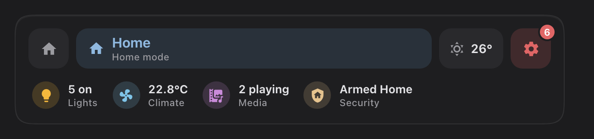
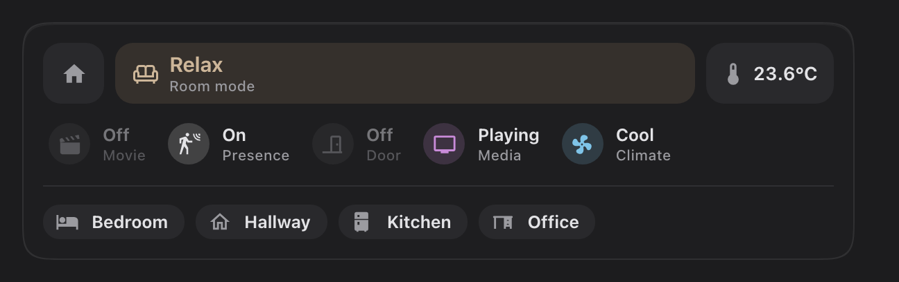
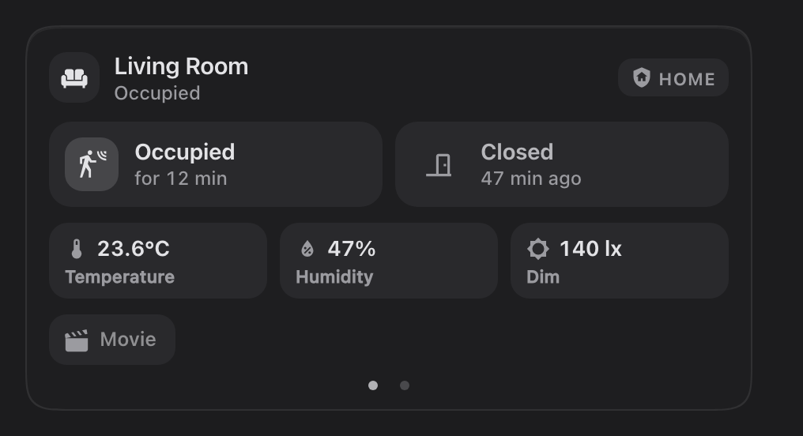
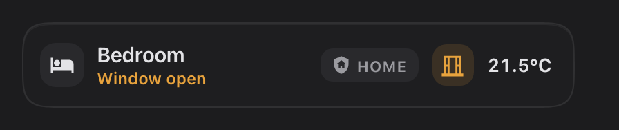
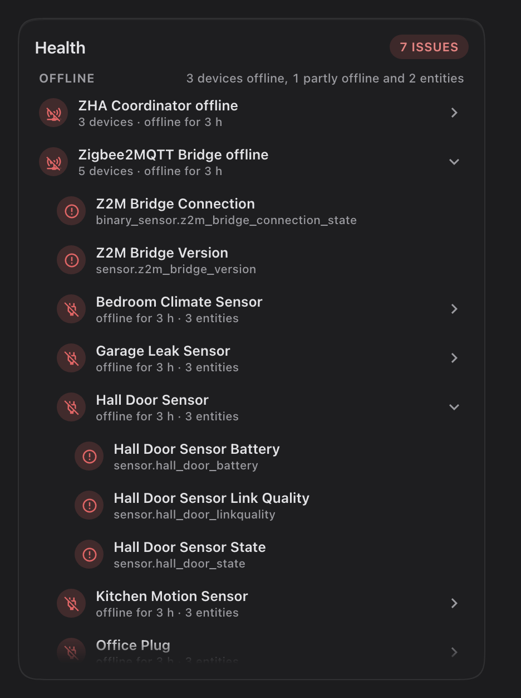
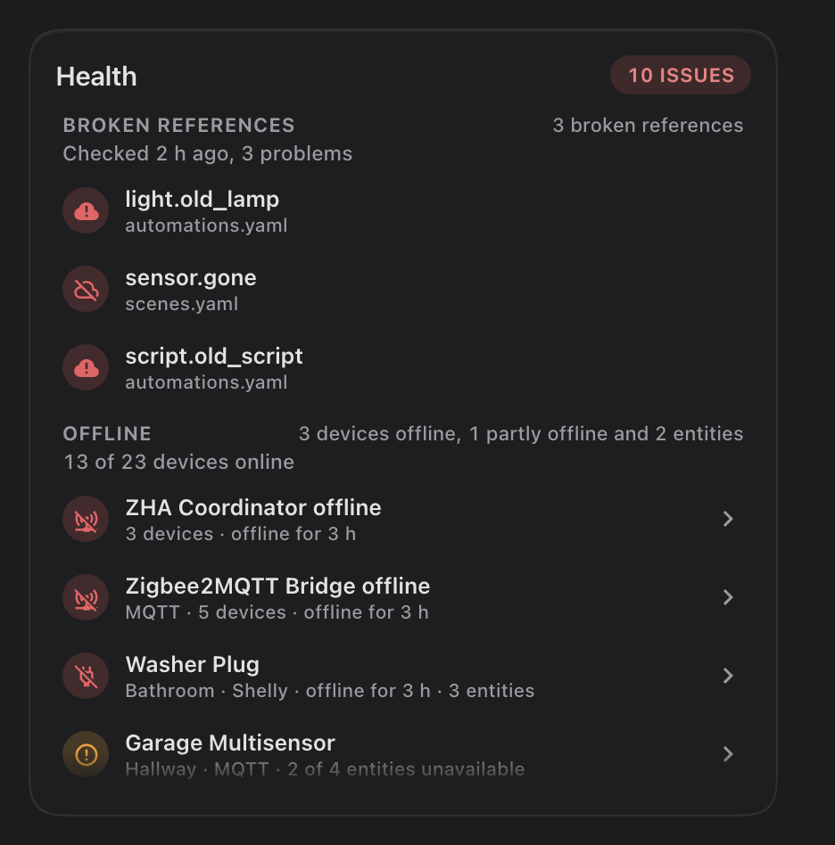

# Savvy Cards

Smart, beautiful cards for Home Assistant. Point a card at a room and it finds what's
there. Every option is in the visual editor, and every card moves and responds the
same way: springs, not transitions; feedback the moment you touch; nothing that jumps.

<p>
  
  
</p>

- [Install](#install)
- [How every Savvy card behaves](#how-every-savvy-card-behaves)
- Cards: [Home](#home) · [Room](#room) · [Heading](#heading) · [Room tile](#room-tile) ·
  [Lights](#lights) · [Climate](#climate) · [Media](#media) · [Camera](#camera) ·
  [Snapshot](#snapshot) · [Vacuum](#vacuum) · [Entity](#entity) · [Graph](#graph) · [Health](#health) ·
  [Scenes](#scenes)

## Install

**HACS:** HACS → ⋮ → Custom repositories → add this repository as a **Dashboard**, then
install **Savvy Cards**. HACS adds the resource for you.

**Manual:** copy `dist/savvy-cards.js` to `/config/www/`, then add `/local/savvy-cards.js`
as a JavaScript module under Settings → Dashboards → ⋮ → Resources. After an update,
bump a `?v=` number on the resource URL; Home Assistant caches these files hard.

Then edit a dashboard, add a card, and search for **Savvy**.

## How every Savvy card behaves

- **Area first.** Give a card an `area` and it finds what's there through Home
  Assistant's area, device and entity registries: no entity-id naming conventions
  needed. Any part can be pointed at a specific entity instead.
- **Every option is in the editor.** YAML works too; the editor leaves options at their
  defaults out of it.
- **`false` turns any automatic part off.**
- **Tap** does the obvious thing, **hold** opens more-info (or the list of what a group
  chip stands for), and **double tap** is only there where it's configured, so single
  taps never wait for it.
- **Chips** use one spec everywhere: `entity`, `name`, `icon`, `color` (an HA colour name
  like `blue` or a hex), `show_state`, and `tap_action` / `hold_action` /
  `double_tap_action` in Home Assistant's standard action format.
- **Sliders only move when you drag sideways.** A tap, or a finger on its way to
  scrolling the page, never changes a value.
- **`layout: compact`** gives the smaller version of a card.
- **Modes.** `mode:` puts any `input_select` or `select` (a house mode, a room's scenes)
  on a card as a chip; tap it for a picker of every option. Each option gets an icon and
  a colour from a built-in dictionary of a few hundred words ("Movie Night" is a movie,
  "Guests" a group of people, "Sleep" a moon); set your own with `mode_icons` /
  `mode_colors`, or per option in the editor. Hold the chip for its more-info.
- **Badges: pinned, then discovered.** The home, room, heading and tile cards show what a
  room has. `entities:` pins yours first, always shown, in your order (a lights helper,
  a presence sensor). Then, with `auto_discover` on (the default), what the area has: one
  badge per kind, presence and doors always, media, locks, climate, fans, covers,
  windows, leaks and smoke while they're active. `exclude_kinds`, `exclude` and
  `include` fine-tune it. Hold a kind with several members for a list of them.
- **Keyboard:** everything is reachable with Tab and the arrow keys; focus rings only
  appear when you use the keyboard.

---

## Home

<picture>
  <source media="(prefers-color-scheme: light)" srcset="docs/images/home-light.png">
  
</picture>

The header for your home dashboard. On top, the house mode (tap to change it), the
weather, and the health cog: its number is exactly what the [Health](#health) card
lists (a device or a hub counts once, however many entities it has), and holding it
shows that list. Below, four chips that count by themselves, with
no helper sensors: lights on (every light in the house, groups left out so nothing counts
twice), the average indoor temperature (the fan spins while an A/C
runs), what's playing, and security (the alarm panel; with none, what's open or
unlocked). Hold any of them for the entities behind it, each with its switch.

```yaml
type: custom:savvy-home-card
mode: input_select.house_mode
health:
  navigation_path: /lovelace/admin
lights:
  tap_action:
    action: navigate
    navigation_path: /lovelace/lights
```

| Option | Default | What it does |
|---|---|---|
| `mode` | none | The house mode. Never guessed; hidden when unset. |
| `mode_label` | `Home mode` | The caption under it. |
| `mode_icons` / `mode_colors` | the dictionary | Per option, one line each under the key: `Movie Night: mdi:popcorn`. |
| `home_path` | none | A home button that opens this path. |
| `weather` | the first weather entity | A weather entity, or `false`. |
| `health` | on | The cog: `navigation_path` (where a tap goes; without one a tap lists the issues), and the Health card's `watchman`, `battery_threshold`, `exclude_platforms`, `warn_above`, `group_by`, `group_min`. `false` hides it. |
| `lights` / `climate` / `media` / `security` | on | Each chip: `false` hides it; or `{ entity, name, icon, color, tap_action, hold_action }`, where `entity` shows that entity's state instead of the count. Tap and hold list what's counted unless set. |
| `chips` | none | Your own chips after the four. |

---

## Room

<picture>
  <source media="(prefers-color-scheme: light)" srcset="docs/images/room-light.png">
  
</picture>

The header at the top of a room's page: its mode and temperature, a row of everything
the room has (pinned first, then everything the area has, on or off, idle ones dimmed),
your chips, and a row to jump to every other room.

```yaml
type: custom:savvy-room-card
area: living_room
mode: input_select.living_room_scene
room_path: /lovelace/{slug}
```

| Option | Default | What it does |
|---|---|---|
| `area` | **required** | The room. |
| `mode`, `mode_label`, `mode_icons`, `mode_colors` | none, `Room mode` | The room's mode or scenes (see [Modes](#how-every-savvy-card-behaves)). |
| `temperature` | found | The area's temperature sensor, else its climate unit's reading. An entity, or `false`. |
| `home_path` | none | A home button that opens this path. |
| `entities`, `auto_discover`, `exclude_kinds`, `include`, `exclude` | discovered | The row (see [Badges](#how-every-savvy-card-behaves)). Here every kind the room has shows, active or not. |
| `icons_only` | `false` | Just the coloured icons. |
| `chips` | none | Your own chips, in a row of their own. |
| `room_path` | none | Turns on the rooms row: where each room goes. `{area}` is the area id, `{slug}` the same with dashes: `/lovelace/{slug}`. |
| `room_order` | by name | Rooms listed first, in this order. The editor starts it as the discovered order. |
| `exclude_rooms` | none | Rooms to leave out. |
| `rooms` | none | Per room: `{ area, name, icon, navigation_path }`. |

---

## Heading

<picture>
  <source media="(prefers-color-scheme: light)" srcset="docs/images/heading-light.png">
  
</picture>

The first card in a room's section: its name and icon (from the area), its mode, its
temperature (warming in colour when it's hot, cooling when it's cold) and its badges. A
heading, not a panel: no background unless `filled: true`.

```yaml
type: custom:savvy-heading-card
area: living_room
navigation_path: /lovelace/living-room
mode: input_select.living_room_scene
```

| Option | Default | What it does |
|---|---|---|
| `area` | **required** (or `name`) | The room. |
| `name` / `icon` | the area's | Title and icon. |
| `navigation_path` | none | Tapping the name opens it (or set `tap_action` / `hold_action`). |
| `mode`, `mode_label`, `mode_icons`, `mode_colors` | none | The room's mode. |
| `temperature` | found | As on the Room card. |
| `entities`, `auto_discover`, `exclude_kinds`, `include`, `exclude` | discovered | The badges. |
| `heading_style` | `title` | `subtitle` for a smaller one. |
| `filled` | `false` | Sit on a card background. |

---

## Room tile

<picture>
  <source media="(prefers-color-scheme: light)" srcset="docs/images/tiles-light.png">
  
</picture>

A room at a glance. Its icon sits in a small drop that fills with the room's light:
brighter as its lights are brighter, tinted by the first coloured bulb, and wobbling like
water when a light switches. Tap to go to the room (or list its lights), double tap to
turn its lights off or on, hold for its lights, each with its switch.

```yaml
type: custom:savvy-room-tile
area: kitchen
navigation_path: /lovelace/kitchen
```

| Option | Default | What it does |
|---|---|---|
| `area` | **required** | The room: its name, icon, lights, temperature, badges. |
| `name` / `icon` | the area's | Title and icon. |
| `navigation_path` | none | Where a tap goes. Without it a tap lists the room's lights. |
| `mode`, `mode_icons`, `mode_colors` | none | Shown under the name, with its colour. Hold it for more-info. |
| `temperature` | found | As on the Room card. |
| `toggle` | none | An entity (a helper wired to your automations) that the double tap switches instead of the lights. With one, lights on while it's off show as a dimmer drop. |
| `lights` | the area's | Only these lights. |
| `count` | counted | A sensor with the number of lights on. |
| `color_lights` | `lights` | Lights whose colour tints the drop. |
| `tint` | `#F5B83D` | The drop's colour for white light. |
| `entities`, `auto_discover`, `exclude_kinds`, `include`, `exclude` | discovered | The badges. A pinned `toggle` entity glows in the drop's colour. |
| `tap_action` / `double_tap_action` / `hold_action` | as above | Override any gesture. |

---

## Lights

<picture>
  <source media="(prefers-color-scheme: light)" srcset="docs/images/lights-light.png">
  
</picture>

Every light in a room, each with only the controls it supports: a toggle; a brightness
bar; a swatch that opens warmth, colour and saturation. The pill turns the room's lights
on and off, or holds an entity of your own. Hold the pill for a live list of the card's
lights.

```yaml
type: custom:savvy-lights-card
area: living_room
```

| Option | Default | What it does |
|---|---|---|
| `area` | **required** (or `lights`) | The area, or a list of areas for one card across rooms. |
| `lights` | discovered | Only these lights, in this order. An item can be `{entity, power}`, where `power` is a smart plug the light sits behind. |
| `title` | the area's name | Card title. |
| `order` | by name | Lights listed here come first, in this order. The editor starts it as the discovered order: reorder with the arrows. |
| `featured` | none | Lights that get a wide tile. |
| `exclude` | none | Lights to leave out. |
| `show_header` | `true` | The title row. |
| `show_toggle` | `true` | The on/off pill. |
| `toggle` | built in | Put an entity in the pill: `{entity, name, icon, tap_action, double_tap_action, hold_action}`. With an entity, a tap toggles it and a double tap turns every light off. |
| `columns` | automatic | Force a column count. |
| `power_button` | `false` | A power button on every tile. |
| `state_detail` | `true` | Brightness under the name; `false` shows plain On/Off. |
| `color_background` | `false` | Tint lit tiles with their bulb's colour. |
| `chips` | none | Extra chips under the lights. |
| `layout` | `full` | `compact`: toggles only, no sliders or swatches. |

<picture>
  <source media="(prefers-color-scheme: light)" srcset="docs/images/lights-compact-light.png">
  
</picture>

---

## Climate

<picture>
  <source media="(prefers-color-scheme: light)" srcset="docs/images/climate-light.png">
  
</picture>

An A/C or thermostat. Drag the bar sideways for the target (or use − and +), tap a mode,
cycle the fan. Swipe left for its history, with the unit's on/off band under the chart.

```yaml
type: custom:savvy-climate-card
area: living_room
```

| Option | Default | What it does |
|---|---|---|
| `area` | **required** (or `entity`) | Finds the area's climate entity. With several, the editor lets you choose. |
| `entity` | from `area` | A specific climate entity. |
| `name` | the entity's name | Card title. |
| `hvac_modes` | the unit's modes | Which modes to show, in order. Quote `"off"` in YAML. |
| `default_hvac_mode` | the last used | What the power button turns on. |
| `fan_control` | `true` | The fan button (tap cycles the speed). |
| `temperature` / `humidity` | the unit's own reading | Sensors to read (and chart) instead. |
| `weather` | none | An outdoor weather readout. |
| `temperature_name` / `humidity_name` / `state_name` | Temperature / Humidity / A/C | Labels. |
| `timer` | none | `{entity, select}`: a timer, and an `input_select` of durations a tap steps through. |
| `history` | `{hours: 24, show_state: true}` | The history page: the range it opens on, and the on/off band. |
| `temperature_scale` | blue to red | Colour stops for temperatures: `[{value, color}]`. |
| `humidity_color` | teal | Humidity colour. |
| `chips` | none | Extra chips (a button presses, a switch toggles). |
| `layout` | `full` | `compact`: the target and modes in two rows. |

<picture>
  <source media="(prefers-color-scheme: light)" srcset="docs/images/climate-compact-light.png">
  
</picture>

---

## Media

<picture>
  <source media="(prefers-color-scheme: light)" srcset="docs/images/media-light.png">
  
</picture>

A room's media, the way the hardware works: sources feed an output. Artwork of what's
playing (it takes the poster's own shape), the video boxes as a picker with the picked
one's transport, the speaker the room listens through with its volume, then presets, text
to speech and the room's alarm clock. The volume only moves on a sideways drag, or with
− and +.

```yaml
type: custom:savvy-media-card
area: living_room
```

| Option | Default | What it does |
|---|---|---|
| `area` | **required** (or `video` / `audio`) | The room's players: speakers and receivers are the output, TVs and the rest the sources. |
| `video` / `audio` | found | The players instead: `{ entity, name, icon, power, output, volume, artwork }`. `power`: a switch that powers it; `output`: where its sound comes out; `volume`: a helper that's its real volume; `artwork`: a binary sensor that says its artwork is worth showing. |
| `video_output` | none | Where every video source's sound comes out (a soundbar). Its volume then sits under it. |
| `name` | the area's | Title. |
| `presets` | none | Chips for stations and playlists. |
| `tts` | none | `{ action, data, placeholder }`: a text box; `$MSG` in `data` is where the text goes. |
| `alarm` | none | `{ entity, time, name }`: an alarm clock that rings here, with its time. |
| `chips` | none | The room's other controls. |
| `labels` | none | `{ video, audio }`: small captions over each band. |
| `artwork` / `artwork_max_height` | on / none | The artwork stage. |
| `volume_step` / `volume_buttons` | `5` / on | The − and + buttons. |
| `layout` | `full` | `compact`: one row, what's playing, its transport and the volume. |

<picture>
  <source media="(prefers-color-scheme: light)" srcset="docs/images/media-compact-light.png">
  
</picture>

---

## Camera

<picture>
  <source media="(prefers-color-scheme: light)" srcset="docs/images/camera-light.png">
  
</picture>

Live cameras, side by side when there's room and a swipe apart when there isn't. With
[Frigate](https://github.com/blakeblackshear/frigate-hass-integration), found by itself
from the cameras: the day's alerts and detections, a motion timeline, and recordings that
play in sync across every camera; swiping between cameras keeps the moment.

```yaml
type: custom:savvy-camera-card
area: [living_room, kitchen]
```

| Option | Default | What it does |
|---|---|---|
| `area` | **required** (or `cameras`) | One or more areas: their cameras. |
| `cameras` | found | Instead: `{ entity, name, area, frigate_camera }`, in this order. |
| `frigate` | found | On when the cameras come from Frigate. `false` turns it off; `{ instance }` names another instance. |
| `recordings` | `popup` | `inline` puts the timeline and reviews in the card; `false` hides them. |
| `columns` | by width | Cameras side by side (`1`: always one at a time). |
| `days` | `7` | Days of recordings to offer. |
| `aspect_ratio` | `16/9` | The tiles' shape. |

---

## Snapshot

<picture>
  <source media="(prefers-color-scheme: light)" srcset="docs/images/snapshot-light.png">
  
</picture>

A security glance at a room: is anything happening, and when did it last happen?
Presence, doors and windows with "for 12 min" or "4 min ago", the room's readings, smoke,
gas and leak sensors that stay quiet until one trips (then a banner and a red wash). While
the alarm is armed, an open door turns amber. Swipe left for the room's history: a lane
per sensor over its temperature, and scrubbing snaps to each change.

```yaml
type: custom:savvy-snapshot-card
area: living_room
```

| Option | Default | What it does |
|---|---|---|
| `area` | **required** (or `chips`) | The room: its sensors, by what they are. |
| `presence` / `door` / `window` / `temperature` / `humidity` / `illuminance` / `smoke` / `gas` / `co` / `leak` | found | Name one (or several) instead, or `false` for none. |
| `exclude_kinds` / `exclude` | none | Kinds, or entities, to leave out. |
| `alarm` | found | The alarm panel (`false`: none). |
| `chips` | none | Your own: a toggle becomes a chip, a door or a number takes its place with the rest. With no `area`, a hand-picked overview. |
| `name` / `icon` | the area's | Title and icon. |
| `navigation_path` | none | Tapping the name goes there. |
| `history` | `{ hours: 24, ranges: [6, 24, 72] }` | The history page; `false` turns it off. |
| `lux_labels` | `{ dark: 10, dim: 150 }` | Light reads as Dark, Dim or Bright; `false` for the number. |
| `layout` | `full` | `compact`: one row of icons and the temperature. |

<picture>
  <source media="(prefers-color-scheme: light)" srcset="docs/images/snapshot-compact-light.png">
  
</picture>

---

## Vacuum

<picture>
  <source media="(prefers-color-scheme: light)" srcset="docs/images/vacuum-light.png">
  
</picture>

Any robot vacuum, deepest for Roborock. Everything is found from the vacuum's device:
the live job, map, rooms (cleaned in the order you tap them), your app routines, modes,
dock and consumables. Rooms, modes, dock and care open as popups. Hold Stop to stop, and
hold "Clean N rooms" to start, so neither happens by accident.

```yaml
type: custom:savvy-vacuum-card
entity: vacuum.robot
```

| Option | Default | What it does |
|---|---|---|
| `entity` | **required** | The vacuum. |
| `name` | the entity's name | Title. |
| `start` | the vacuum's own start | What Start runs: a button, script or scene (an app routine, say). Resume after a pause is always a real resume. |
| `start_name` | `Start` | Start's label. |
| `navigation_path` | none | Tapping the name opens this page. |
| `map` | `popup` | `popup` (a Map button), `inline`, `off`, or an image/camera entity. |
| `map_max_height` | none | Cap the map's height (px). |
| `rooms` | `auto` | Your areas when mapped, else the robot's own rooms. `off`, or a list to limit, order or rename. |
| `routines` | `auto` | Your app routines. `off`, or `[{entity, name, icon}]`. |
| `modes` / `dock` / `maintenance` / `stats` | `auto` | `off` hides a part. |
| `hide_modes` | none | Mode selects to leave out. |
| `exclude` | none | Discovered entities to leave out. |
| `battery_warn` / `battery_critical` | `20` / `10` | The battery ring turns amber / red below these. |
| `layout` | `full` | `compact`: one row with a start / pause button; hold it to send the vacuum home. |

<picture>
  <source media="(prefers-color-scheme: light)" srcset="docs/images/vacuum-compact-light.png">
  
</picture>

---

## Entity

<picture>
  <source media="(prefers-color-scheme: light)" srcset="docs/images/entity-light.png">
  
</picture>

One entity and the ones that belong with it. A person gets their picture (or initials),
their zone and "Home · for 3 h"; anything else its icon, state and how long. Chips
underneath: a toggle flips the moment it's tapped, a button presses, anything else shows
its value.

```yaml
type: custom:savvy-entity-card
entity: person.alex
chips:
  - entity: switch.scooter_plug
    name: Scooter
```

| Option | Default | What it does |
|---|---|---|
| `entity` | **required** | The main entity. |
| `name` / `icon` / `color` / `picture` | the entity's | Its look. |
| `show_state` / `show_since` | on | The state, and how long. |
| `navigation_path`, `tap_action` / `hold_action` / `double_tap_action` | more-info | The main entity's actions. |
| `chips` | none | The entities that belong with it. |

---

## Graph

<picture>
  <source media="(prefers-color-scheme: light)" srcset="docs/images/graph-light.png">
  
</picture>

Tiles that know what they are: a number gets a graph (with its minimum, maximum and
average, and a scrub bubble), anything else a small tile with its state. Past a week, a
graph reads Home Assistant's long-term statistics, so a month of costs just works.

```yaml
type: custom:savvy-graph-card
title: System
entities:
  - entity: sensor.processor_use
    thresholds:
      - value: 0
        level: good
      - value: 60
        level: warn
      - value: 85
        level: bad
```

| Option | Default | What it does |
|---|---|---|
| `entities` | **required** | The tiles: `{ entity, attribute, name, icon, unit, hours_to_show, thresholds, state_color, tap_action, hold_action }`. `attribute` charts one of the entity's attributes instead of its state (a weather entity's `humidity`). `thresholds` colour a graph good / warn / bad; `state_color` makes an on/off tile green or red. |
| `title` | none | Title. |
| `hours_to_show` | `24` | Every graph's range, unless a tile sets its own. |
| `ranges` | none | An hours selector in the header, e.g. `[24, 168, 720]`. |
| `columns` | automatic | Small tiles per row. |

---

## Health

<picture>
  <source media="(prefers-color-scheme: light)" srcset="docs/images/health-light.png">
  
</picture>

What in the house needs attention, in three sections: what's **offline**, which **batteries**
are low, and (if you use [Watchman](https://github.com/dummylabs/thewatchman)) the
**broken references** in your own configuration, meaning an entity or action your
automations, scripts or dashboards use that doesn't exist. One count, and every section
always shows: what's wrong in a line ("3 devices offline"), or a tick and what's fine
("Everything is online").

Offline entities are grouped the way you think about them. All the unavailable entities of
one device are one issue, the device. And when a hub is down (a Zigbee bridge or
coordinator, anything other devices are attached to) the devices behind it become one
issue too: "Zigbee2MQTT Bridge offline, 34 devices". Home Assistant itself records which
device sits behind which hub, so nothing is guessed from names. A device with only some of
its entities unavailable is shown as "2 of 9 entities unavailable", in a softer colour, and
never rolls into a hub. Tap a hub or a device to open it, tap an entity for its more-info,
hold a device for its page in Home Assistant.

```yaml
type: custom:savvy-health-card
```

| Option | Default | What it does |
|---|---|---|
| `source` | `all` | `all`, or one list: `battery`, `unavailable` (titled Offline), `watchman` (titled Broken references). |
| `title` | per source | Title. |
| `details` | `false` | A line of facts under each section ("42 devices, all online", "18 batteries, lowest 34%", "Checked 2 h ago, 0 problems"), and area and integration on the rows. |
| `group_by` | `hub` | How offline entities become issues: `hub` (devices, and the hub behind them), `device`, or `none` (one row per entity). |
| `group_min` | `3` | How many down devices a hub needs before they roll up into it. |
| `battery_threshold` | `20` | A battery below this % is low. |
| `exclude_platforms` | `[mobile_app]` | Integrations to ignore (phones, by default). |
| `watchman` | none | Watchman's summary sensors. |
| `watchman_last_run` | found | Watchman's "last parse" timestamp, shown as "Checked 2 h ago" (under the title with `source: watchman`, in the details line otherwise). Found from the Watchman integration; name another sensor, or `false` to hide it. |
| `warn_above` | `6` | The count turns red at this many issues (a hub or a device counts as one). |
| `max_rows` | `7` | Rows before the list scrolls. |
| `show_all_batteries` | `true` | With `source: battery`: every battery, low ones first. |
| `action` | none | A footer button: `{label, tap_action}`. |

A hub opened, and one of its devices opened inside it, and the same with `details: true`:

<picture>
  <source media="(prefers-color-scheme: light)" srcset="docs/images/health-expanded-light.png">
  
</picture>

<picture>
  <source media="(prefers-color-scheme: light)" srcset="docs/images/health-details-light.png">
  
</picture>

<picture>
  <source media="(prefers-color-scheme: light)" srcset="docs/images/health-batteries-light.png">
  
</picture>

---

## Scenes

<picture>
  <source media="(prefers-color-scheme: light)" srcset="docs/images/scene-light.png">
  
</picture>

Every scene of a room as a tile: tap runs it, hold opens its details. Give it an area
(or several) and it finds the scenes there, named without the room's name in front. A
scene lights for a few seconds after it runs, from this card or from anywhere else.

```yaml
type: custom:savvy-scene-card
area: office
strip: '^.*//\s*|\s*-\s*on$'      # "Office // Work - On" reads "Work"
```

| Option | Default | What it does |
|---|---|---|
| `area` | none | An area, or a list of them. Scenes that are hidden or disabled are left out. |
| `title` | none | A heading over the tiles. |
| `layout` | `full` | `compact` is one scrolling row of pills. |
| `columns` | 2 to 4 by width | Tiles per row (1 to 6). |
| `entities` | none | Pinned scenes, first and in order, even from outside the area. A string, or `{ entity, name, icon, color }`. |
| `auto_discover` | on | Also the area's scenes, after the pinned ones. |
| `exclude` | none | Scenes never shown. |
| `strip` | the area's name | A regular expression taken out of every name (any case, every match); then the area's name is taken off the front. `false`: names stay whole. A pinned scene's own `name` is used as written. |
| `color` / `show_icon` | `blue` / on | The tint (an HA colour name or hex), and the icons. |
| `navigation_path` | none | Tapping the title goes there (the heading reads "Scenes" if you gave no `title`). |
